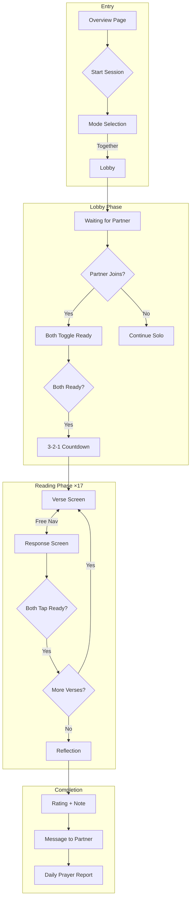
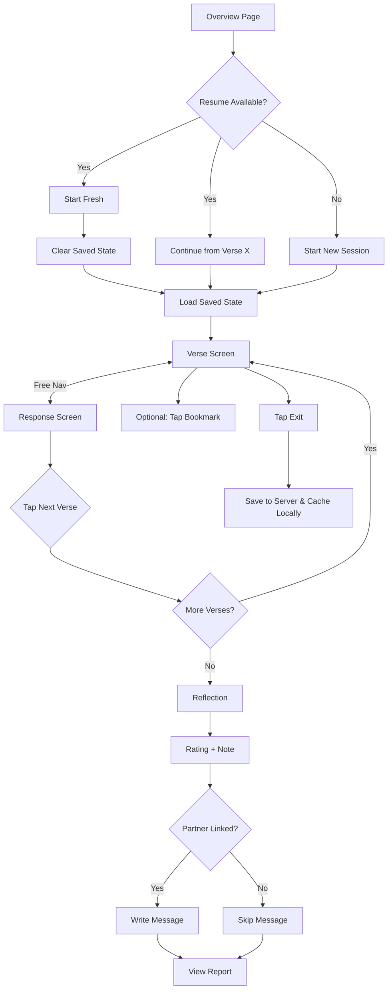
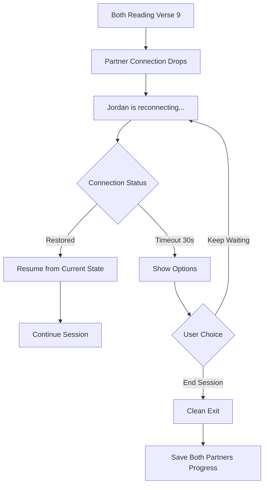

---
stepsCompleted:
  - 1
  - 2
  - 3
  - 4
  - 5
  - 6
  - 7
  - 8
  - 9
  - 10
  - 11
  - 12
  - 13
  - 14
workflowComplete: true
inputDocuments:
  - _bmad-output/planning-artifacts/prd.md
  - _bmad-output/planning-artifacts/prd-validation-report.md
  - docs/project-context.md
  - docs/index.md
  - docs/architecture-overview.md
  - docs/technology-stack.md
  - docs/data-models.md
  - docs/api-reference.md
  - docs/component-inventory.md
  - docs/service-layer.md
  - docs/state-management.md
  - _bmad-output/project-knowledge/index.md
sourceOfTruth: _bmad-output/planning-artifacts/prd.md
constraints:
  - Zustand state management (slice pattern)
  - Supabase Broadcast for real-time sync
  - IndexedDB caching with optimistic UI (server is source of truth)
  - Service layer architecture
  - WCAG AA accessibility
  - prefers-reduced-motion support
---

# UX Design Specification - My-Love

**Author:** Salvain
**Date:** 2026-01-25

---

## Executive Summary

### Project Vision

Scripture Reading for Couples is a guided spiritual activity designed as a calm, "safe-to-be-honest" ritual for connection and repair. The feature helps couples soften toward each other, communicate better (especially after conflict), and build trust through repeated, gentle practice.

The experience consists of 17 scripture steps paired with couple-focused response prayers across themes of healing, forgiveness, confession, peace, words, and character. Couples can engage together in real-time (synchronized roles) or solo when apart or when a partner is unavailable.

**Core Principle:** Calm and minimal. Every design decision prioritizes emotional safety over engagement metrics.

### Target Users

**Primary Users:** Committed couples (married or long-term relationships) seeking structured spiritual connection

**User Contexts:**
- **Post-conflict repair** — Using the reading to soften and reconnect after tension
- **Long-distance connection** — Solo mode to feel spiritually connected when apart
- **Regular practice** — Building a gentle habit of shared spiritual time
- **Asymmetric availability** — One partner ready when the other isn't

**Device Context:** Mobile-first (intimate settings: bed, couch), with desktop as secondary

**Tech Savviness:** Intermediate — expect smooth, intuitive UX with minimal friction

### Key Design Challenges

1. **Emotional Safety Architecture** — The UI must feel calm, supportive, and judgment-free. No gamification pressure. Gentle error handling. Warm but not patronizing language.

2. **Together Mode Synchronization** — Two users, two devices, one shared real-time experience. Clear role distinction (Reader/Responder), natural phase transitions, purposeful waiting states, seamless reconnection.

3. **Accessibility in Intimate Context** — WCAG AA compliance, mobile-first touch targets (≥44px), screen reader support for dynamic content, `prefers-reduced-motion` respect, proper focus management.

4. **Optimistic UI Reliability** — Solo mode uses optimistic UI with IndexedDB caching. Changes appear instant; server syncs in background. Cached data viewable offline; writes require eventual connectivity.

### Design Opportunities

1. **"Repair Ritual" Experience** — Position the feature as a structured way to soften and reconnect. The 3-second countdown creates shared anticipation. Mutual reflection submission creates vulnerability together.

2. **Bookmark Flag for Reflection** — Per-verse bookmarking lets users mark "this matters to me" during the session, which resurfaces at reflection time.

3. **Daily Prayer Report as Relationship Bridge** — End-of-session messages and side-by-side reflections are where emotional payoff happens. Opportunity for beautiful, meaningful presentation that reinforces connection.

## Core User Experience

### Platform Strategy

| Aspect | Decision | Rationale |
|--------|----------|-----------|
| **Primary Platform** | Mobile PWA | Intimate settings (bed, couch) demand mobile-first |
| **Interaction Model** | Touch-first | Bottom-anchored actions, thumb-friendly targets |
| **Offline Resilience** | Cached data viewable; writes require connectivity | Graceful degradation with optimistic UI |
| **Together Mode** | Online-required | Real-time sync requires network |
| **Desktop** | Works but not optimized | Secondary use case |

**Technical Integration:**
- Zustand state (new scriptureReadingSlice)
- Supabase Broadcast for real-time sync
- IndexedDB for read caching and optimistic UI (server is source of truth)
- Framer Motion animations with `prefers-reduced-motion` support

### Effortless Interactions

**Natural & Automatic:**
- Phase progression updates instantly across devices without jarring transitions
- Reflection submission requires no confirmation dialogs
- Solo progress saves continuously without explicit action
- Online sync happens silently in background
- Reconnection restores Together mode to current phase automatically
- Focus management moves appropriately after phase transitions

**Pain Points We Avoid:**
- Slow or unreliable sync
- Excessive confirmation dialogs
- Unexpected progress loss
- Broken reconnection flows

### Critical Success Moments

| Moment | Experience | Stakes |
|--------|------------|--------|
| **First countdown** | Both ready, 3...2...1 appears together | The "together" magic is established |
| **First lock-in** | Both tap "Ready for next verse" | Trust in sync is built |
| **Bookmark flag** | User marks a verse that matters | Personal reflection is supported |
| **Daily Prayer Report reveal** | Session ends, messages revealed | Emotional payoff is delivered |
| **Resume after interruption** | User returns, picks up seamlessly | Trust in reliability is maintained |

### Experience Principles

1. **Calm Over Engagement** — Never gamify, pressure, or guilt. The UI is a quiet sanctuary, not a productivity app.

2. **Synchronized Intimacy** — Together mode feels like being in the same room. Phase transitions are smooth, waiting feels purposeful.

3. **Invisible Reliability** — Optimistic UI, background sync, reconnection just work. Users never think about them. Cached data available when offline; writes sync when connectivity returns.

4. **Vulnerability is Invited, Not Demanded** — Bookmarks, notes, and reflections are invitations. Nothing required. Nothing judged.

5. **Mobile-First, Touch-Native** — Every interaction designed for thumbs on a phone. Bottom-anchored actions, generous touch targets.

## Desired Emotional Response

### Primary Emotional Goals

| Moment | Primary Emotion | Why It Matters |
|--------|-----------------|----------------|
| **Starting a session** | Safe & Unhurried | No pressure, no guilt — they chose this freely |
| **After choosing mode** | Relieved & Grounded | "Okay, we're doing something constructive" |
| **During the reading** | Present & Connected | Fully in the moment, aware of partner |
| **Bookmarking a verse** | Acknowledged | "This one matters to me" |
| **At the Daily Prayer Report** | Tender & Relieved | "We didn't solve everything, but we softened" |
| **Returning next time** | Welcomed & Gentle | Like returning to a familiar, comforting ritual |

**Differentiating Emotion:** Not productivity ("we completed 17 steps!") but **presence** ("we were actually together for a moment") and **relief** ("we can breathe again").

### Emotional Journey Mapping

| Stage | Discovery | Start | Mid-Session | End | Return |
|-------|-----------|-------|-------------|-----|--------|
| **Emotions** | Curious, Hopeful | Unhurried, Safe | Relieved, Present, Honest | Tender, Relieved, Grateful | Welcomed, Gentle, Ready |

**Relief Progression:**
- **Early:** "Okay, we're doing something constructive" (choosing mode)
- **Mid:** "We're reading together, on the same page" (during session)
- **End:** "We didn't solve everything, but we softened" (Daily Prayer Report)

**Error State Emotions:**
- Partner doesn't join → Neutral acceptance, not abandonment
- Network drops → Calm patience, not alarm
- Partner offline → Presence-aware waiting, not problem-focused

### Micro-Emotions

**Cultivate:**
- **Confidence** — Users always know what to do next
- **Trust** — Data is safe, sync works, partner is present
- **Belonging** — This is "our" ritual, personalized with partner names
- **Permission** — Honesty and struggle are welcomed, not exposed
- **Relief** — Tension releases progressively through the session

**Avoid:**
- **Guilt** — No streaks, no "you've been away" shaming
- **Pressure** — No notifications pushing completion
- **Exposure** — Private reflections, controlled sharing
- **Confusion** — Crystal clear phase transitions

### Design Implications

| Emotion | UX Approach |
|---------|-------------|
| **Safe & Unhurried** | No timers (except countdown). Generous transitions. |
| **Relieved & Grounded** | Calm confirmation when mode chosen. No "are you sure?" dialogs. |
| **Present & Connected** | Partner name visible. Partner position indicator. Synchronized moments. |
| **Honest & Unjudged** | Rating is neutral (1-5). Bookmarks are personal. Notes truly optional. |
| **Tender & Relieved** | Daily Prayer Report beautifully presented. Partner message revealed gently. |
| **Welcomed & Gentle** | Warm resume prompts. No accusatory language. |

**Subtle Delight Moments:**
- Countdown animation creates shared anticipation
- Partner's message revealed like receiving a gift
- Bookmarked verses highlighted at reflection time

### Emotional Design Principles

1. **Safety First** — When in doubt, choose the gentler, less pressuring option.

2. **Presence Over Performance** — Celebrate connection, not completion.

3. **Relief as Design Goal** — Each interaction should release tension, not add to it.

4. **Permission Without Expectation** — All vulnerability features are genuine invitations.

5. **Gentle Failures** — Error states use warm, neutral language. Never blame. Never alarm.

6. **Ritual, Not Task** — Use ritual language:
   - ✓ "Continue," "Reflect," "Close for now," "End for today"
   - ✗ "Submit," "Finish," "Done," "Complete"

## UX Pattern Analysis & Inspiration

*Intentionally prioritizing internal consistency and emotional principles over external pattern borrowing. Reference apps are optional for implementation; the design direction is derived from established principles above.*

## Design System Foundation

### Design System Choice

**Decision:** Extend the existing My-Love design system (Tailwind CSS + Framer Motion + Lucide) rather than introducing new tooling.

The current utility-first setup with custom pastel themes, rounded glass-like surfaces, and established component patterns provides a flexible foundation. Scripture Reading will reuse existing infrastructure while introducing targeted new components for its unique interactions.

### Existing System Analysis

**Visual Language:**
- Soft gradients (pink, rose, sunset, ocean, lavender) with rounded, glass-like surfaces
- `Inter` (sans) for UI, `Playfair Display` (serif) for elegance, `Dancing Script` (cursive) for personal touches
- Glass morphism: white/80% backgrounds with backdrop blur
- Consistent hover/tap feedback with scale transforms

**Themes Available:**

| Theme | Mood | Scripture Reading Fit |
|-------|------|----------------------|
| **Ocean Breeze** | Calm, trust, peace | Strong — sanctuary feel |
| **Lavender Dreams** | Spiritual, intimate | Strong — contemplative |
| Sunset Romance | Playful, energetic | Default app theme — slightly energetic for reflection |
| Rose Garden | Classic, sophisticated | Neutral |

**Recommendation:** Scripture Reading screens should prefer `ocean` or `lavender` backgrounds (or muted variants) to signal a calm, contemplative mood distinct from the app's more energetic default. Same typography and card shapes; only subtle gradient adjustments needed.

### Components to Reuse

| Existing Component | Scripture Reading Usage |
|--------------------|------------------------|
| `.btn-primary`, `.btn-secondary` | "Continue," "Reflect" actions |
| `.input` (soft blurred field) | Optional note textarea |
| `.card` (rounded-3xl + backdrop blur) | Step cards, reflection prompts |
| `MoodDetailModal` pattern | Reflection modal, step detail overlays |
| `MoodButton` selection pattern | Adapt for verse selection in reflection |
| `MessageInput` | Daily Prayer Report message composition |
| `SyncToast` | Feedback on reflection save, sync status |
| `NetworkStatusIndicator` | Offline/reconnecting states |
| `BottomNavigation` | Add "Scripture" tab to ViewType |
| `CountdownTimer` celebration animations | Inspiration for 3-2-1 countdown |
| Safe-area utilities (`safe-top`, `safe-bottom`) | Notch-aware layout |

### New Components Required

Scripture Reading introduces **8 custom components** to support synchronized reading, role clarity, and emotional payoff moments:

| Component | Purpose | Implementation Notes |
|-----------|---------|---------------------|
| `<Countdown>` | 3-2-1 synchronized start | Framer Motion variants; static fallback for `prefers-reduced-motion` |
| `<RoleIndicator>` | "You read this" / "Partner reads this" | Pill-style badge on verse/response; subtle styling |
| `<BookmarkFlag>` | Per-verse "this matters to me" toggle | Small icon, instant toggle, resurfaces at reflection |
| `<PartnerPosition>` | Shows where partner is viewing | "Jordan is viewing the response" — subtle text |
| `<LockInButton>` | "Ready for next verse" with both-must-confirm | Shows waiting state when one has locked in |
| `<SessionProgress>` | Show current verse position | Text-only ("Verse 5 of 17"), no progress bar |
| `<ReflectionSummary>` | End-of-session: verse selection, rating, note, message | Bookmarked verses highlighted |
| `<DailyPrayerReport>` | Partner message reveal, side-by-side comparison | Two-column layout, card styling |

### Session Layout Contract

Even without a dedicated shell component, all reading screens follow consistent layout rules:

```
┌────────────────────────────────────┐
│ safe-top padding                   │
├────────────────────────────────────┤
│ TOP AREA                           │
│ - SessionProgress (left)           │
│ - PartnerPosition (right/below)    │
├────────────────────────────────────┤
│ CENTER AREA                        │
│ - Content cards (verse/response)   │
│ - Vertically centered              │
│ - Max-width constrained            │
├────────────────────────────────────┤
│ BOTTOM AREA                        │
│ - Primary CTA (LockInButton, etc.) │
│ - Full-width, thumb-zone position  │
├────────────────────────────────────┤
│ safe-bottom padding                │
└────────────────────────────────────┘
```

**Layout Rules:**
- All reading screens use this three-zone layout
- Safe-area utilities applied consistently (`safe-top`, `safe-bottom`)
- Primary actions always bottom-anchored in thumb zone
- Progress always visible at top
- Content cards vertically centered with max-width constraint

### Component Specifications

#### `<SessionProgress>` (Text-Only)

**Purpose:** Show current verse position without task-like pressure

**Implementation:**
- Content: "Verse 5 of 17" (text only, NO progress bar)
- Rationale: Progress bars emphasize completion over presence; text feels informational, not task-y
- Position: Top-left of reading screens
- Typography: Inter 500, 12px (xs), muted purple (#9B7DB8)
- Accessibility: `aria-label="Currently on verse 5 of 17"`

**Why text-only:** Progress bars feel task-oriented ("how much is left?"). Text aligns with "ritual, not task" principle — it's informational without pressure.

#### `<Countdown>` Accessibility

**Motion behavior:**
- Default: Animated number transitions with scale/fade
- Reduced motion: Static number display, no animation

**Accessibility:**
- Single `aria-live="polite"` announcement: "Session starting in 3 seconds"
- Visual countdown numbers: `aria-hidden="true"` (to prevent per-number announcements)
- Final announcement: "Session started"
- Focus: Container receives focus when countdown begins

**Why polite, not assertive:** `aria-live="assertive"` per number is too aggressive for screen reader users. One announcement at start, one at completion.

#### `<BookmarkFlag>` Design Decision

> **Design Decision:** BookmarkFlag replaces the PRD's "help/sensitive flag" per stakeholder decision (Step 7).
>
> **What we lose:**
> - Explicit empathy signal to partner ("I'm struggling here")
> - Vulnerability sharing in Daily Prayer Report
> - Direct request for partner's attention/care
>
> **What we gain:**
> - Simpler emotional dynamics (no pressure on partner to "help")
> - Personal reflection tool (not a communication signal)
> - Lower stakes — marking interest, not vulnerability
> - Aligns with "safe" principle — no risk of feeling exposed
>
> **Rationale:** The feature should feel safe. Vulnerability signals could backfire in sensitive moments. Bookmarks achieve the "this matters to me" goal without emotional complexity.

#### Waiting State Guidelines (No-Blame Copy)

When one partner has locked in and is waiting for the other:

**Primary line (blame-free):** "We'll continue when you're both ready"

**Secondary line (subtle status):**
- "Jordan is viewing the verse"
- "Jordan is reconnecting..."

**Never use as primary:** "Waiting for Jordan..." (subtly makes partner the bottleneck, can feel pressuring in conflict contexts)

**Animation:**
- Subtle pulse animation (2s cycle)
- Respects `prefers-reduced-motion` (no pulse when enabled)

**Tone:** Presence-aware, never problem-focused. The UI communicates togetherness, not waiting.

### Phase Transition Accessibility

**Focus Management Rules:**

| Transition | Focus Target |
|------------|--------------|
| Lobby → Countdown | Countdown container |
| Countdown → Verse 1 | Verse heading |
| Verse ↔ Response | Navigation button that was used |
| Step N → Step N+1 | Verse heading |
| Reading → Reflection | Reflection form heading |
| Reflection → Report | Report heading |

**ARIA Announcement Strategy:**
- Use `aria-live="polite"` region for phase changes
- Announce: "Moved to verse 5" / "Now in reflection" / "Report ready"
- Partner status: polite region for "Jordan is ready"
- Never interrupt with assertive (except critical errors)

**Screen Reader Experience:**
- Phase changes announced once, not repeatedly
- Focus moves to logical starting point for each phase
- Partner actions announced subtly (polite), never disruptively

### Accessibility Gap: Reduced Motion

**Finding:** The codebase currently has no `prefers-reduced-motion` support.

**Required for Scripture Reading (per PRD):**
- Add `useReducedMotion()` hook from Framer Motion
- Countdown: Fall back to static count display
- Phase transitions: Instant swap instead of crossfade
- Floating/pulsing elements: Disable or simplify

**Implementation Pattern:**
```typescript
import { useReducedMotion } from 'framer-motion';

const shouldReduceMotion = useReducedMotion();
const transition = shouldReduceMotion
  ? { duration: 0 }
  : { type: 'spring', stiffness: 100, damping: 15 };
```

### Customization Strategy

**What stays the same:**
- Font stack (Inter/Playfair/Dancing Script)
- Card styling (rounded-3xl, glass morphism)
- Button shapes and interaction patterns
- Icon library (Lucide React)
- Animation library (Framer Motion)

**What adapts:**
- Background gradients: Muted/cooler for reflection screens
- Color intensity: Softer during reading phases
- Animation timing: Slower, more deliberate transitions to match calm mood

**What's new:**
- Bookmark flag component (per-verse)
- Lock-in button with dual-confirm pattern
- Partner position indicator
- Two-person state machine UI patterns

## Defining Experience

### The Core Interaction

**Scripture Reading in one sentence:** *"A shared prompter for couples reading scripture aloud together."*

Partners are **hearing each other** — either on a phone call or in the same room. The app serves as a synchronized reading guide that shows what to read, who reads it, and ensures both partners progress together.

**The defining moment:** Both partners tap "Ready," the 3-2-1 countdown completes, and the first verse appears on both screens simultaneously. They're reading together.

### User Mental Model

**How users think about this:**
- "It's like a shared teleprompter for our devotional"
- "It's karaoke but for scripture — shows us the words, we read aloud"
- "It keeps us on the same page, literally"

**What they bring from other experiences:**
- Shared screen experiences (watching together, video calls)
- Turn-based conversation (one speaks, one listens)
- Physical Bible reading together (but now works when apart)

**Where confusion could happen:**
- "Whose turn is it?" → Role indicator must be clear
- "Where is my partner?" → Position indicator shows what screen they're on
- "Can I go back?" → Free navigation within each step, clear affordance

### Session Flow (Free Navigation with Lock-In)

**1. Lobby & Start**
- Both partners enter lobby
- Both tap "Ready"
- 3-2-1 countdown → Session begins

**2. Per-Verse Flow (repeated 17 times)**

```
┌─────────────────────────────────────────────────────────────┐
│                     VERSE STEP N                            │
├─────────────────────────────────────────────────────────────┤
│  Both see: Verse text                                       │
│  Reader indicator: "You read this" / "Partner reads this"   │
│                                                             │
│  [Bookmark flag] - tap to mark "this matters to me"         │
│                                                             │
│  ← Back    [View Response →]                                │
├─────────────────────────────────────────────────────────────┤
│  Both see: Response text                                    │
│  Responder indicator: "You respond" / "Partner responds"    │
│                                                             │
│  [← Back to Verse]                                          │
├─────────────────────────────────────────────────────────────┤
│  Partner position: "Jordan is viewing the response"         │
│                                                             │
│  [Ready for next verse]  ← Both must lock in to proceed     │
└─────────────────────────────────────────────────────────────┘
```

**Free navigation rules:**
- Either partner can move between verse ↔ response freely
- Partner position indicator shows where they are (subtle)
- "Ready for next verse" button available on either screen
- Both must tap "Ready" to advance — can't skip ahead alone
- Roles alternate: Reader on verse N becomes Responder on verse N+1

**3. End-of-Session Reflection**

After verse 17, both enter reflection phase:

| Element | Description |
|---------|-------------|
| **Bookmarked verses** | Show list of verses user flagged during session |
| **"Which verse stood out?"** | Select from all 17 (bookmarked ones highlighted) |
| **Session rating** | 1-5 scale — "How meaningful was this session?" |
| **Optional note** | Free text reflection |
| **Message to partner** | "Write something for [Name]" |

**4. Daily Prayer Report**

Both submit → Report reveals:
- Partner's message (unveiled)
- Which verse they selected as standout
- Their session rating (side-by-side)
- Which verses they bookmarked (if they opted to share)

### Bookmark Flag (Per-Verse)

**Purpose:** Personal reminder during session — "this one matters to me."

**UX:**
- Small flag/bookmark icon on verse screen
- Tap to toggle (filled = bookmarked)
- No confirmation, instant toggle
- Bookmarked verses highlighted in reflection phase

**Language:**
- Simple bookmark icon (no label needed)
- At reflection: "Verses you marked" with list

**Bookmark Privacy Rule:**
- Bookmarks are **private by default** (partner cannot see during session)
- At reflection time: Single global toggle — "Share the verses you marked in today's report? (optional)"
- In Daily Prayer Report: Only show partner's bookmarks if they opted in
- Rationale: "Exposure" is an avoided emotion. Private-by-default with opt-in aligns with "safe" principle.
- MVP scope: One toggle for all bookmarks (not per-verse sharing)

### Lock-In Mechanism

**The "both must confirm" pattern:**

This ensures synchronized progression without allowing one partner to rush ahead.

**States:**
1. Neither locked in → Button shows "Ready for next verse"
2. You locked in, partner hasn't → Button shows "You're ready ✓ (tap to undo)" (secondary style, tappable) + Secondary line: "We'll continue when you're both ready"
3. Both locked in → Auto-advance to next verse with brief transition

**Why it works:**
- Prevents rushing
- Creates natural pause points for conversation
- Both actively choose to move forward together
- Reinforces "we're doing this together" feeling

### Success Criteria

| Criterion | What it means |
|-----------|---------------|
| **"Same page"** | Both partners always know where the other is |
| **"Natural pace"** | Free to re-read, no rushing, lock-in prevents skipping |
| **"Clear turns"** | Role indicators remove "whose turn?" confusion |
| **"Together"** | Lock-in mechanism ensures synchronized progression |
| **"Remembered"** | Bookmarks resurface at reflection, nothing lost |

## Visual Design Foundation

### Color System

**Primary Theme:** Lavender Dreams

Scripture Reading will use the Lavender Dreams theme to create a spiritual, contemplative atmosphere distinct from the app's default Sunset Romance energy.

**Lavender Dreams Palette:**
- **Primary:** #A855F7 (Purple)
- **Secondary:** #C084FC (Light purple)
- **Background:** #F3E5F5 (Pale lavender)
- **Text:** #4A1F6F (Dark purple)
- **Accent:** #D8B4FE (Lighter purple)

**Semantic Color Mapping for Scripture Reading:**

| Purpose | Color | Usage |
|---------|-------|-------|
| **Background** | Lavender gradient | Reading screens, reflection |
| **Card surface** | White/80% + blur | Verse cards, input fields |
| **Primary text** | #4A1F6F | Verse text, headings |
| **Secondary text** | #6B4D8A | Response text, labels |
| **Muted text** | #9B7DB8 | Partner position, hints |
| **Role indicator (Reader)** | #A855F7 | "You read this" badge |
| **Role indicator (Responder)** | #C084FC | "You respond" badge |
| **Bookmark active** | #F59E0B (Amber) | Filled bookmark icon |
| **Bookmark inactive** | #D8B4FE | Empty bookmark outline |
| **Lock-in button** | Primary gradient | "Ready for next verse" |
| **Waiting state** | Secondary with pulse | "You're ready ✓ (tap to undo)" |

**Accessibility:**
- Designed to meet WCAG AA (4.5:1 normal text, 3:1 large text); verify with contrast checks during implementation, especially muted text on gradients and glass surfaces
- #4A1F6F on #F3E5F5 = 7.2:1 contrast ratio ✓
- Interactive elements have visible focus states

### Typography System

**Font Stack:**
- **UI/Body:** Inter (400, 500, 600)
- **Scripture:** Playfair Display (400, 500)
- **Personal touches:** Dancing Script (for partner messages in Daily Prayer Report)

**Type Scale for Scripture Reading:**

| Element | Font | Weight | Size | Line Height |
|---------|------|--------|------|-------------|
| **Verse reference** | Inter | 500 | 12px (xs) | 1.5 |
| **Verse text** | Playfair Display | 400 | 20px (xl) | 1.75 |
| **Response text** | Inter | 400 | 16px (base) | 1.6 |
| **Role indicator** | Inter | 500 | 14px (sm) | 1.4 |
| **Partner position** | Inter | 400 | 12px (xs) | 1.5 |
| **Button text** | Inter | 500 | 16px (base) | 1.5 |
| **Reflection prompts** | Inter | 500 | 18px (lg) | 1.6 |
| **Partner message (report)** | Dancing Script | 400 | 18px (lg) | 1.6 |

**Typography Principles:**
- Verse text is largest and most prominent — it's the focus
- UI elements (buttons, indicators) use Inter for clarity
- Partner messages in Daily Prayer Report use Dancing Script for personal warmth
- Generous line-height on scripture for breathable reading

### Spacing & Layout Foundation

**Base Unit:** 4px (Tailwind default)

**Spacing Scale:**
- `1` = 4px — Tight spacing (icon gaps)
- `2` = 8px — Small spacing (inline elements)
- `3` = 12px — Medium-small (button padding vertical)
- `4` = 16px — Medium (card internal margins)
- `6` = 24px — Large (card padding, section gaps)
- `8` = 32px — Extra-large (between major sections)

**Layout Principles:**

1. **Generous white space** — Scripture reading should feel airy, not cramped. Err on the side of more space.

2. **Single-column mobile** — Full-width cards, bottom-anchored actions. No side-by-side layouts on mobile.

3. **Thumb-zone actions** — Primary buttons ("Ready for next verse") positioned in bottom 40% of screen.

4. **Safe areas respected** — Use `safe-top` and `safe-bottom` utilities for notch-aware layouts.

**Card Layout:**
- Padding: 24px (p-6)
- Border radius: 24px (rounded-3xl)
- Background: white/80% with backdrop-blur
- Shadow: subtle (shadow-lg)

**Touch Targets:**
- Minimum 44×44px for all interactive elements
- Bookmark flag: 48×48px hit area
- Lock-in button: Full-width, 56px height

### Accessibility Considerations

**Visual Accessibility:**
- WCAG AA contrast compliance for all text
- Focus indicators on all interactive elements (ring-2 ring-purple-400)
- No color-only information (icons accompany color states)

**Motion Accessibility:**
- `prefers-reduced-motion` support required
- Countdown: Static display fallback
- Transitions: Instant swap fallback
- No auto-playing animations without user control

**Screen Reader Support:**
- Semantic HTML (headings, buttons, landmarks)
- ARIA labels for icon-only buttons (bookmark flag)
- Live regions for partner position updates
- Focus management on screen transitions

**Touch Accessibility:**
- 44px minimum touch targets
- Adequate spacing between interactive elements (≥8px)
- No hover-only interactions

## Design Direction Decision

### Design Directions Explored

An interactive HTML mockup was created (`ux-design-directions.html`) showcasing 7 key screens:

1. **Lobby** — Partner presence, dual ready buttons
2. **Countdown** — 3-2-1 shared anticipation animation
3. **Verse Screen (Reader)** — Role indicator, bookmark flag, Playfair typography
4. **Response Screen** — Partner role indicator, back navigation
5. **Lock-in Waiting** — "You're ready" with partner presence indicator
6. **Reflection** — Bookmarked verses, rating, message composition
7. **Daily Prayer Report** — Partner message reveal, side-by-side comparison

### Chosen Direction

**Single unified direction** based on Lavender Dreams theme with the following characteristics:

**Visual Style:**
- Lavender Dreams purple gradient backgrounds
- Glass morphism cards (white/80% + backdrop blur)
- Playfair Display for scripture, Inter for UI, Dancing Script for partner messages
- Soft shadows and rounded-3xl corners

**Interaction Patterns:**
- Role indicators as pill badges with microphone icons
- Bookmark flag with instant toggle (amber when active)
- Partner position indicator with subtle pulse animation
- Lock-in button with waiting state transformation
- "Stood out to you" / "Stood out to [Partner]" labels for verse comparison

**Information Hierarchy:**
- "Verse X of 17" as progress indicator
- Scripture text largest and most prominent
- Role and partner position as secondary information
- Actions bottom-anchored in thumb zone

### Design Rationale

1. **Lavender Dreams theme** supports the spiritual, contemplative mood — distinct from the app's energetic default
2. **Glass morphism cards** maintain consistency with existing My-Love design language
3. **Clear role indicators** prevent "whose turn?" confusion without being intrusive
4. **Partner position visibility** reinforces "we're doing this together" without requiring verbal coordination
5. **Bottom-anchored actions** respect mobile ergonomics (thumb zone)
6. **Dancing Script for partner messages** creates intimate, personal reveal moment

### Implementation Approach

**Reuse existing patterns:**
- Card, button, and input styling from My-Love design system
- Framer Motion animation patterns
- Safe-area and responsive utilities

**Create new components (8 total):**
- `<Countdown>` with reduced-motion fallback
- `<RoleIndicator>` pill badge
- `<BookmarkFlag>` toggle with instant feedback
- `<PartnerPosition>` with pulse animation
- `<LockInButton>` with waiting state
- `<SessionProgress>` text-only position indicator
- `<ReflectionSummary>` form layout
- `<DailyPrayerReport>` reveal layout

**Reference mockup:** `_bmad-output/planning-artifacts/ux-design-directions.html`

### Implementation Roadmap

| Phase | Components | Priority | Rationale |
|-------|------------|----------|-----------|
| **Phase 1 — Core Sync** | Countdown, RoleIndicator, LockInButton, PartnerPosition, SessionProgress | P0 | Required for Together mode to function |
| **Phase 2 — Session Completion** | BookmarkFlag, ReflectionSummary, DailyPrayerReport | P1 | MVP scope; Daily Prayer Report is the emotional payoff |

**P0 (Core Sync):** Without these, Together mode doesn't work. Users can't see roles, can't progress together, can't track position.

**P1 (Session Completion):** All MVP scope per PRD. BookmarkFlag supports reflection; ReflectionSummary captures session response; DailyPrayerReport delivers the emotional payoff that makes the feature meaningful.

**Note:** DailyPrayerReport is P1 (not P2) because it's explicitly MVP scope in the PRD. The partner message reveal is the "why" of the feature — where couples actually connect.

## User Journey Flows

### Together Mode Flow

Partners join lobby, ready-up, and sync through 17 verses with free navigation:

1. **Lobby**: Partner joins → Both toggle ready → 3-2-1 countdown
2. **Reading (×17)**: Verse ↔ Response (free nav) → Both tap "Ready" → Next verse
3. **Reflection**: View bookmarked verses → Rating → Note → Submit
4. **Report**: Write message → See partner's bookmarks & message

**Key mechanics:**
- Free navigation within each verse/response pair
- Lock-in: Both must confirm to advance
- Partner position indicator shows where they're viewing
- Bookmark flag per-verse surfaces at reflection
- **Role alternation**: Reader on verse N becomes Responder on verse N+1



### Solo Mode Flow

Self-paced reading with optimistic UI and save/resume:

1. **Entry**: Resume prompt if previous session incomplete
2. **Reading**: Verse ↔ Response (free nav) → "Next Verse" → Repeat
3. **Save/Exit**: Progress saved to IndexedDB, resumable anytime
4. **Reflection**: Bookmarked verses → Rating → Note
5. **Report**: Message to partner (if linked) → View summary

**"Start fresh" option:** When resume is available, user can choose "Start fresh" to explicitly clear saved state (preserves agency while keeping auto-save invisible).



### Lobby Fallback Flow

Graceful degradation when partner doesn't join:

1. Waiting animation with "Continue solo" option (no shame language)
2. Smooth transition to solo mode
3. Prayer report still sent to partner asynchronously
4. Copy: "Continue solo" / "Try together another time"

**No-Shame UX Copy:**
- ✓ "Continue solo" (not "Partner didn't show up")
- ✓ "Try together another time" (not "Partner abandoned you")
- ✓ Prayer report still sent — builds connection asynchronously

### Reconnection Flow

Handling dropped connections mid-session:

1. "Partner reconnecting..." indicator
2. 30-second timeout before showing "End Session" option
3. Server-authoritative state ensures clean resync
4. Both partners' progress saved on clean exit



### Journey Patterns

**Navigation Patterns:**
- **Free navigation**: Move between verse ↔ response at will
- **Lock-in advance**: Cannot proceed until partner confirms
- **Position indicator**: Shows where partner is viewing

**Decision Patterns:**
- **Binary ready state**: Toggle ready/not ready (no ambiguity)
- **Auto-save on exit**: Progress saves automatically; no prompt needed
- **No-shame fallbacks**: All language is neutral and gentle

**Feedback Patterns:**
- **Partner presence**: Subtle indicator of partner's current view
- **Progress indicator**: "Verse 5 of 17" (text-only, no progress bar — ritual, not task)
- **Bookmark confirmation**: Brief animation when verse bookmarked
- **Transition smoothness**: Fade between verses (respects `prefers-reduced-motion`)

### Flow Optimization Principles

1. **Minimize steps to value**: 3 taps from overview to reading
2. **Reduce cognitive load**: One action per screen (read OR respond OR advance)
3. **Clear progress**: Always visible verse count and partner status
4. **Moments of delight**: Countdown builds anticipation; report reveals partner's heart
5. **Graceful errors**: Seamless reconnection, clean exit always available

## UX Consistency Patterns

### Button Hierarchy

Scripture Reading uses a three-tier button hierarchy consistent with My-Love's existing patterns:

| Tier | Purpose | Style | Examples |
|------|---------|-------|----------|
| **Primary** | Advances session | Full-width, Lavender gradient, 56px | "Ready for next verse" |
| **Secondary** | Navigation within step | Outlined, transparent | "View Verse", "View Response" |
| **Tertiary** | Optional actions | Text-only, muted | Bookmark toggle, "Close for now" |

**Navigation symmetry:** "View Verse" ↔ "View Response"

#### Lock-In Button States

| State | Button Text | Helper | Visual |
|-------|-------------|--------|--------|
| **Available** | "Ready for next verse" | — | Primary |
| **You're Ready** | "Ready ✓" | "Tap to undo" | Secondary + check |
| **Sync Paused** | "Holding your place" | "Reconnecting..." | Muted + indicator |
| **Both Ready** | "Continuing..." | — | Fade out, 300-400ms |

Below button when waiting: "We'll continue when you're both ready"

### Partner Presence Feedback

Three-state indicator extending existing color system:

| State | Color | Indicator |
|-------|-------|-----------|
| **Same page** | Yellow (#FCC419) | Lit |
| **Different pages** | Red (#FF6B6B) | Lit |
| **Both ready** | Green (#51CF66) | Lit |
| **Disconnected** | — | Off |

**Accessibility:** State changes announced via `aria-live="polite"`

### Form Patterns

#### Verse Selection
- Display only bookmarked verses (not all 17)
- Uses `MoodButton` pattern with `aria-pressed`
- Min 48×48px touch targets
- If no bookmarks: "You didn't mark any verses — that's okay"

#### Session Rating
- Prompt: "How meaningful was this for you today?"
- 1-5 numbered circles
- End labels: "A little" ↔ "A lot"
- Radiogroup with proper ARIA

#### Textareas
- Uses `.input` class + `min-h-[80px]` + `resize-none`
- Auto-grow up to ~4 lines
- Character counter at 200+ (muted), soft limit at 1000

#### Validation
- Required: Verse selection + Rating
- Timing: On "Continue" tap only
- Missing field: Quiet helper text, button stays disabled
- No red flashes

### Phase Transition Animations

| Transition | Animation | Duration |
|------------|-----------|----------|
| Lobby → Countdown | Fade + scale | 300ms |
| Countdown → Verse 1 | Crossfade | 400ms |
| Verse ↔ Response | Crossfade | 200ms |
| Step → Step | Slide left + fade | 300ms |
| Reading → Reflection | Fade through white | 400ms |

**Reduced motion:** All animations respect `prefers-reduced-motion` with instant swap fallback.

**Focus management:** Focus moves to logical target after each transition (verse heading, form heading, report heading).

**Timing principles:** Max 400ms, consistent rhythm, no bouncing or parallax.

## Responsive Design & Accessibility

### Responsive Strategy

#### Breakpoint Approach

Use standard Tailwind breakpoints with single-column layout at all sizes:

| Breakpoint | Width | Layout |
|------------|-------|--------|
| **Mobile** | < 640px (default) | Single column, full-width cards |
| **sm** | 640px+ | Same layout, slightly more padding |
| **md** | 768px+ | Session Layout Contract, max-w-md centered |
| **lg** | 1024px+ | Same as md |

**No custom breakpoints.** Scripture Reading is single-column content designed for intimacy, not productivity.

#### Desktop/Tablet Constraint

On `md+`, use the Session Layout Contract (from Step 11) with `max-w-md` container centered.

*Implementation example (pseudocode):*
```
container: max-w-md, mx-auto, px-4
```

#### Safe Areas

Always apply safe-area utilities on mobile (`safe-top`, `safe-bottom`).

#### Keyboard Overlap Handling

During reflection/message entry, ensure the bottom CTA doesn't get covered by the on-screen keyboard:

| Approach | Notes |
|----------|-------|
| Sticky CTA moves above keyboard | Use viewport-aware positioning |
| Or collapse CTA while typing | Hide "Continue" until textarea loses focus |
| Prevent scroll jumps | Scroll textarea into view smoothly on focus |

*Implementation note:* Use `window.visualViewport` when available; otherwise fall back to CSS-safe layout and scroll anchoring.

### Accessibility Strategy

#### WCAG Level

**Target: WCAG AA** (per PRD requirement)

#### Keyboard & Focus

Every interactive element must be keyboard-reachable:

| Element | Keyboard Access |
|---------|-----------------|
| Lock-in button | Tab + Enter/Space |
| Navigation buttons | Tab + Enter |
| Bookmark toggle | Tab + Enter/Space |
| Verse chips | Tab + Enter, arrow keys within group |
| Rating circles | Tab + arrow keys (radiogroup) |
| Textareas | Tab + standard input behavior |

**Focus visibility:** Ensure a visible focus ring on all Scripture Reading controls, matching the app's existing focus style. Do not introduce a new global focus rule unless approved.

#### Reduced Motion

`prefers-reduced-motion` applies to **everything**, not just countdown:

| Animation | Normal | Reduced Motion |
|-----------|--------|----------------|
| Countdown numbers | Scale + fade | Static display |
| Phase transitions | Crossfade 200-400ms | Instant swap |
| Partner presence pulse | 2s pulse cycle | No pulse, static |
| Report reveal | Fade in | Instant display |
| Button state changes | Spring animation | Instant |

#### Screen Reader Announcements

**Don't over-announce.** Rules:

| Event | Announcement | Throttle |
|-------|--------------|----------|
| Phase change | "Now on verse 5" | Once per change |
| Partner ready | "Jordan is ready" | Once |
| Partner position | "Jordan is viewing response" | Only on verse/response switch |
| Sync status | "Holding your place" | Once on state change |

**Critical rule:** Announce only when the semantic state changes, not when props re-render. This prevents repeated announcements due to state churn.

Use `aria-live="polite"` for all announcements — never `assertive`.

#### Touch Target Requirements

Minimum 48×48px hit area for all interactive elements:

| Element | Requirement |
|---------|-------------|
| Lock-in button | Full-width, 56px height |
| Navigation buttons | Full-width or 48px+ height |
| Bookmark icon | Hit area must be 48×48px |
| Verse chips | Must be 48×48px minimum |
| Rating circles | Must be 48×48px each |
| Toggle row | Entire row must be tappable |

Spacing between touch targets: minimum 8px.

#### Color Contrast

**Status:** Designed to meet WCAG AA (4.5:1 normal text, 3:1 large text)

**Caveat:** Gradients and glass blur surfaces can reduce contrast. Verify during implementation:
- Muted text (#9B7DB8) on Lavender gradient background
- Text on glass surfaces (white/80% + backdrop blur)
- Disabled/waiting state text

#### Input Ergonomics

For reflection textareas:

| Property | Requirement |
|----------|-------------|
| Mobile keyboard hint | `enterKeyHint="done"` |
| Auto-grow | Up to 4 lines visible |
| Resize | Disabled (`resize-none`) |
| Scroll behavior | Smooth scroll into view on focus |

### Testing Strategy

#### Responsive Testing

- [ ] 320px wide viewport — smallest supported
- [ ] iPhone 14 Pro (393px) — common size
- [ ] iPad (768px) — tablet layout
- [ ] Desktop (1024px+) — centered constraint

#### Accessibility Testing

- [ ] Keyboard-only navigation through entire flow
- [ ] VoiceOver (iOS) / TalkBack (Android) full session
- [ ] `prefers-reduced-motion` enabled — verify no motion
- [ ] OS accessibility contrast settings where available; browser forced-colors if supported
- [ ] Zoom to 200% — verify layout doesn't break
