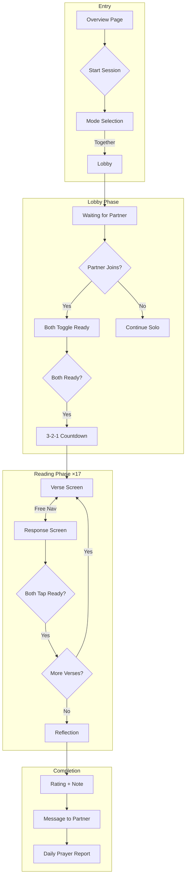
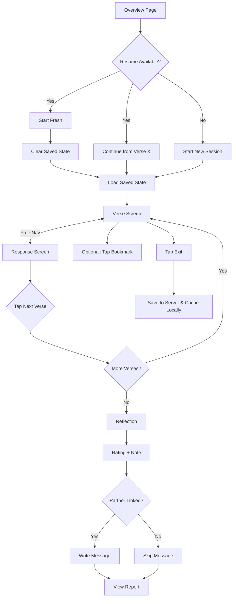
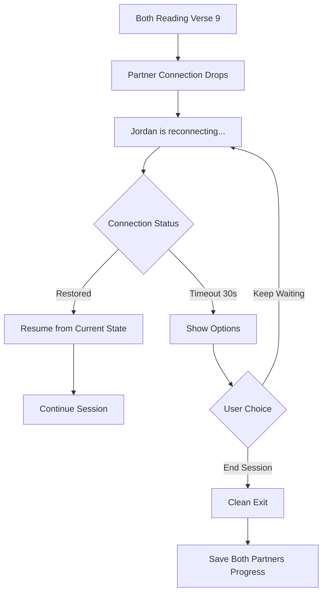

# User Journey Flows

## Together Mode Flow

Partners join lobby, ready-up, and sync through 17 verses with free navigation:

1. **Lobby**: Partner joins → Both toggle ready → 3-2-1 countdown
2. **Reading (×17)**: Verse ↔ Response (free nav) → Both tap "Ready" → Next verse
3. **Reflection**: View bookmarked verses → Rating → Note → Submit
4. **Report**: Write message → See partner's bookmarks & message

**Key mechanics:**
- Free navigation within each verse/response pair
- Lock-in: Both must confirm to advance
- Partner position indicator shows where they're viewing
- Bookmark flag per-verse surfaces at reflection
- **Role alternation**: Reader on verse N becomes Responder on verse N+1

## Solo Mode Flow

Self-paced reading with optimistic UI and save/resume:

1. **Entry**: Resume prompt if previous session incomplete
2. **Reading**: Verse ↔ Response (free nav) → "Next Verse" → Repeat
3. **Save/Exit**: Progress saved to IndexedDB, resumable anytime
4. **Reflection**: Bookmarked verses → Rating → Note
5. **Report**: Message to partner (if linked) → View summary

**"Start fresh" option:** When resume is available, user can choose "Start fresh" to explicitly clear saved state (preserves agency while keeping auto-save invisible).

## Lobby Fallback Flow

Graceful degradation when partner doesn't join:

1. Waiting animation with "Continue solo" option (no shame language)
2. Smooth transition to solo mode
3. Prayer report still sent to partner asynchronously
4. Copy: "Continue solo" / "Try together another time"

**No-Shame UX Copy:**
- ✓ "Continue solo" (not "Partner didn't show up")
- ✓ "Try together another time" (not "Partner abandoned you")
- ✓ Prayer report still sent — builds connection asynchronously

## Reconnection Flow

Handling dropped connections mid-session:

1. "Partner reconnecting..." indicator
2. 30-second timeout before showing "End Session" option
3. Server-authoritative state ensures clean resync
4. Both partners' progress saved on clean exit

## Journey Patterns

**Navigation Patterns:**
- **Free navigation**: Move between verse ↔ response at will
- **Lock-in advance**: Cannot proceed until partner confirms
- **Position indicator**: Shows where partner is viewing

**Decision Patterns:**
- **Binary ready state**: Toggle ready/not ready (no ambiguity)
- **Auto-save on exit**: Progress saves automatically; no prompt needed
- **No-shame fallbacks**: All language is neutral and gentle

**Feedback Patterns:**
- **Partner presence**: Subtle indicator of partner's current view
- **Progress indicator**: "Verse 5 of 17" (text-only, no progress bar — ritual, not task)
- **Bookmark confirmation**: Brief animation when verse bookmarked
- **Transition smoothness**: Fade between verses (respects `prefers-reduced-motion`)

## Flow Optimization Principles

1. **Minimize steps to value**: 3 taps from overview to reading
2. **Reduce cognitive load**: One action per screen (read OR respond OR advance)
3. **Clear progress**: Always visible verse count and partner status
4. **Moments of delight**: Countdown builds anticipation; report reveals partner's heart
5. **Graceful errors**: Seamless reconnection, clean exit always available
