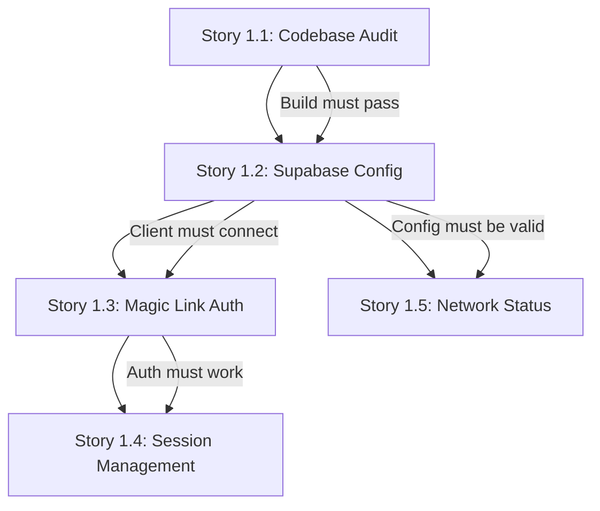

# Epic Technical Specification: PWA Foundation Audit & Stabilization

Date: 2025-11-17
Author: Frank
Epic ID: 1
Status: Draft

---

## Overview

Epic 1 establishes a stable foundation for the My-Love PWA by systematically auditing the existing codebase, validating core dependencies, and ensuring fundamental infrastructure (authentication, session management, network resilience) functions correctly. This epic transforms the current brownfield PWA from an uncertain state into a verified, reliable baseline that all subsequent features can build upon.

The existing PWA uses React 19.1.1 + Vite 7.1.7 + TypeScript 5.9 (strict mode) + Zustand 5.0.8 + Tailwind CSS 3.4.18 with Supabase 2.81+ for backend services. Rather than adding new features, Epic 1 focuses on **auditing what exists**, **fixing what's broken**, and **ensuring deployment infrastructure works**. This audit-first approach prevents building new features on an unstable foundation.

The epic delivers value to developers by providing confidence in the existing codebase and to users by ensuring basic functionality (login, session persistence, offline indication) works reliably across modern browsers (Chrome 90+, Firefox 90+, Safari 15+, Edge 90+).

## Objectives and Scope

**In Scope:**

- Audit all dependencies in package.json for compatibility and security vulnerabilities
- Validate TypeScript strict mode compliance with zero type errors
- Verify ESLint and Vite build pass without warnings
- Confirm PWA manifest.json and service worker configuration (vite-plugin-pwa)
- **Validate GitHub Pages deployment pipeline succeeds** (explicit deployment validation)
- Validate Supabase client connection and configuration with environment variables
- Verify Zustand store persistence via localStorage/IndexedDB
- Test magic link authentication flow including URL redirect handling on production domain
- Ensure session management persists across browser sessions
- Validate existing network status detection OR document gap for future implementation
- Verify Row Level Security (RLS) policies exist and are accessible (test query, not creation)
- Confirm responsive design works from 320px to 1920px viewports (FR61)
- **Capture baseline metrics** (bundle size, load time, test coverage percentage) before Epic 2

**Out of Scope:**

- New feature development (Love Notes, Push Notifications, etc.)
- Database schema creation (handled in subsequent epics)
- UI component development beyond status indicators
- Performance optimization beyond baseline requirements
- User-facing feature enhancements
- Backend/Supabase Edge Functions development
- Creating new RLS policies (only validate existing ones)

**Validation Failure Protocol:**

When validation reveals issues, apply this decision tree:

- **Critical (blocks Epic 2):** Fix immediately within this epic
- **Non-critical (doesn't block):** Document in "Technical Debt" section, defer to appropriate epic
- **Unknown state:** Document gap with recommended remediation, flag for architecture review

**Success Criteria:**

1. All tests pass (Vitest + Playwright)
2. Zero npm audit vulnerabilities (or documented exceptions with risk assessment)
3. Zero TypeScript errors in strict mode
4. Magic link auth completes end-to-end on production domain (GitHub Pages)
5. Sessions persist across browser close/reopen
6. Network status detection validated OR gap documented with implementation plan
7. PWA installable with valid manifest and service worker
8. **GitHub Pages deployment succeeds without manual intervention**
9. **Baseline metrics captured:** Bundle size < 500KB, initial load < 3s, test coverage documented

## System Architecture Alignment

**Referenced Architecture Components:**

This epic directly validates the core infrastructure defined in the Architecture document:

| Component                  | Architecture Reference         | Epic 1 Validation                                    |
| -------------------------- | ------------------------------ | ---------------------------------------------------- |
| **React 19 + Vite 7**      | Core framework stack           | Story 1.1: Build passes, HMR works, no deprecations  |
| **TypeScript 5.9**         | Strict mode enforced           | Story 1.1: Zero type errors, ESLint compliance       |
| **Supabase 2.81+**         | Auth, Database, Realtime       | Story 1.2: Client connects, RLS accessible           |
| **Zustand 5.0.8**          | Client state + persistence     | Story 1.2: Stores hydrate on reload                  |
| **localStorage/IndexedDB** | Preference persistence (FR62)  | Story 1.2 & 1.4: Preferences survive sessions        |
| **PWA Manifest + SW**      | Installability (FR60)          | Story 1.1: Valid manifest, service worker registered |
| **Magic Link Auth**        | Supabase Auth (FR1, FR4)       | Story 1.3: Full flow validates                       |
| **Session Management**     | Persistent sessions (FR2, FR3) | Story 1.4: Sessions survive browser restart          |
| **Online-First Pattern**   | Service worker caching         | Story 1.5: Graceful degradation on network loss      |

**Architectural Constraints:**

- Online-first architecture (NOT offline-first sync) - aligns with NFR-I1
- Service worker caching via Workbox for static assets only
- Supabase client must handle reconnection gracefully (NFR-I2)
- Environment variables must use `VITE_` prefix for Vite compatibility
- Hash-based or history-based routing must work with GitHub Pages deployment

**Integration Points Validated:**

- Supabase Auth → Magic link redirect URL handling
- Supabase Client → Environment variable configuration
- Zustand → localStorage persistence middleware
- Service Worker → vite-plugin-pwa configuration
- Browser APIs → navigator.onLine, 'online'/'offline' events

**Critical Risk Mitigations:**

| Risk                                          | Mitigation Strategy                                                                               | Validation Point                                         |
| --------------------------------------------- | ------------------------------------------------------------------------------------------------- | -------------------------------------------------------- |
| **Magic link redirects fail on GitHub Pages** | Test with actual production domain (/My-Love/ base path), verify hash routing compatibility       | Story 1.3: End-to-end auth on deployed site              |
| **Service worker caches stale auth tokens**   | Configure cache-first ONLY for static assets (JS/CSS/images), network-first for all API calls     | Story 1.1: Review vite-plugin-pwa config                 |
| **RLS policies don't exist**                  | Test query with authenticated user, verify policies return expected data, NOT create new policies | Story 1.2: SELECT query against tables with auth context |
| **Safari localStorage quota exceeded**        | Add quota check before storing, implement fallback strategy if quota < 5MB                        | Story 1.4: Test with Safari, check available quota       |
| **Environment variables exposed**             | Verify VITE_SUPABASE_PUBLISHABLE_DEFAULT_KEY is anon key (safe to expose), never SUPABASE_SERVICE_KEY            | Story 1.2: Audit .env file, verify no service keys       |

## Detailed Design

### Services and Modules

Epic 1 validates the existing module structure rather than creating new modules. The expected structure under validation:

```
src/
├── lib/
│   ├── supabase.ts          # Story 1.2: Supabase client configuration
│   └── env.ts               # Story 1.2: Environment variable validation
├── stores/
│   ├── authStore.ts         # Story 1.4: Auth session persistence
│   ├── userStore.ts         # Story 1.4: User preferences persistence
│   └── index.ts             # Story 1.2: Zustand store exports
├── hooks/
│   ├── useAuth.ts           # Story 1.3: Auth flow hook
│   ├── useNetworkStatus.ts  # Story 1.5: Online/offline detection
│   └── useSession.ts        # Story 1.4: Session management hook
├── pages/
│   ├── Login.tsx            # Story 1.3: Magic link login page
│   ├── AuthCallback.tsx     # Story 1.3: URL redirect handler
│   └── Home.tsx             # Story 1.4: Authenticated home page
├── components/
│   └── StatusIndicator.tsx  # Story 1.5: Network status UI (if exists)
└── types/
    ├── auth.ts              # Story 1.3: Auth type definitions
    └── env.d.ts             # Story 1.1: Vite env type declarations
```

**Module Validation Criteria:**

| Module                       | Validation                                                  | Story |
| ---------------------------- | ----------------------------------------------------------- | ----- |
| `src/lib/supabase.ts`        | Creates client with VITE\_ env vars, handles auth callbacks | 1.2   |
| `src/stores/*`               | Zustand persist middleware configured, hydrates on reload   | 1.2   |
| `src/hooks/useAuth.ts`       | Magic link flow works end-to-end                            | 1.3   |
| `src/pages/AuthCallback.tsx` | Handles redirect URLs without infinite loops                | 1.3   |
| `vite.config.ts`             | Build passes, PWA plugin configured, base path set          | 1.1   |
| `package.json`               | No security vulnerabilities, compatible versions            | 1.1   |

**Gap Documentation:** If any module is missing or incomplete, document in "Technical Debt" section with severity assessment.

### Data Models and Contracts

Epic 1 validates data contracts but does NOT create new database schemas. Validation focuses on:

**1. Supabase Auth Session (Story 1.3, 1.4)**

```typescript
// Expected session structure from Supabase Auth
interface Session {
  access_token: string;
  refresh_token: string;
  expires_in: number;
  expires_at: number;
  token_type: string;
  user: User;
}

interface User {
  id: string; // UUID
  email: string;
  created_at: string; // ISO timestamp
  updated_at: string;
  app_metadata: {
    provider?: string;
    providers?: string[];
  };
  user_metadata: Record<string, unknown>;
}
```

**Validation:** Session persists in localStorage via `supabase-auth-token` key, refresh works, expires_at honored.

**2. Zustand Store Persistence (Story 1.2, 1.4)**

```typescript
// Expected persisted state structure
interface PersistedAuthState {
  isAuthenticated: boolean;
  userId: string | null;
  email: string | null;
}

interface PersistedUserPrefs {
  theme: 'light' | 'dark' | 'system';
  lastSync: number; // Unix timestamp
}
```

**Validation:** States serialize to JSON, survive browser restart, version migrations handled.

**3. Environment Variables Contract (Story 1.2)**

```typescript
// Expected .env structure
interface ImportMetaEnv {
  readonly VITE_SUPABASE_URL: string; // https://xxx.supabase.co
  readonly VITE_SUPABASE_PUBLISHABLE_DEFAULT_KEY: string; // eyJ... (public anon key)
  readonly MODE: string; // development | production
  readonly BASE_URL: string; // /My-Love/
}
```

**Validation:** All VITE\_ prefixed vars accessible, no service keys exposed, BASE_URL matches GitHub Pages path.

### APIs and Interfaces

**Browser APIs Under Validation:**

| API                                           | Purpose                  | Story    | Validation Method                      |
| --------------------------------------------- | ------------------------ | -------- | -------------------------------------- |
| `navigator.onLine`                            | Network status detection | 1.5      | Toggle airplane mode, verify detection |
| `window.addEventListener('online'/'offline')` | Network change events    | 1.5      | Listen for events on network toggle    |
| `localStorage.setItem/getItem`                | State persistence        | 1.2, 1.4 | Store and retrieve test data           |
| `localStorage.remainingSpace`                 | Quota checking (Safari)  | 1.4      | Verify quota available                 |
| `IndexedDB`                                   | Alternative persistence  | 1.2      | Test if Zustand uses IDB fallback      |
| `ServiceWorker.register()`                    | PWA service worker       | 1.1      | Verify SW registered and active        |

**Supabase Client API Methods Validated:**

```typescript
// Story 1.2: Client initialization
supabase = createClient(VITE_SUPABASE_URL, VITE_SUPABASE_PUBLISHABLE_DEFAULT_KEY, {
  auth: {
    persistSession: true,
    storage: localStorage,
    autoRefreshToken: true,
    detectSessionInUrl: true, // Critical for magic link handling
  },
});

// Story 1.3: Magic link authentication
await supabase.auth.signInWithOtp({ email, options: { emailRedirectTo } });
await supabase.auth.getSession(); // After redirect callback

// Story 1.4: Session management
supabase.auth.onAuthStateChange((event, session) => {
  /* handle */
});
await supabase.auth.signOut();

// Story 1.2: RLS policy test
await supabase.from('profiles').select('*').single(); // Should respect RLS
```

**Validation:** Each method executes without errors, returns expected shapes, handles errors gracefully.

### Workflows and Sequencing

**Story Execution Order (Dependencies):**



**Validation Workflow Per Story:**

1. **Story 1.1** - Codebase Audit
   - Run `npm audit` → Fix or document vulnerabilities
   - Run `tsc --noEmit` → Zero errors required
   - Run `npm run lint` → Zero errors required
   - Run `npm run build` → Success required
   - Inspect `manifest.json` → Valid PWA metadata
   - Verify service worker registration → Active SW required

2. **Story 1.2** - Supabase Configuration
   - Load `.env` → Verify VITE\_ vars present
   - Import supabase client → No runtime errors
   - Call `supabase.auth.getSession()` → Returns null or valid session
   - Query test table → RLS policies respond (403 or data, not connection error)
   - Check Zustand stores → `persist` middleware configured

3. **Story 1.3** - Magic Link Flow
   - Navigate to login page → Renders without error
   - Submit email → Supabase sends magic link (check email)
   - Click magic link → Redirects to app with token in URL
   - App extracts token → Session established
   - User lands on home → Authenticated state confirmed

4. **Story 1.4** - Session Persistence
   - Authenticated user → Close browser completely
   - Reopen browser → App auto-restores session (no login screen)
   - Click logout → Session cleared, redirect to login
   - Verify localStorage → Auth tokens removed on logout
   - Test quota → Safari localStorage has >1MB available

5. **Story 1.5** - Network Resilience
   - Online state → Status indicator shows green "Online"
   - Toggle network off → Status changes to red "Offline" within 2s
   - Toggle network on → Status returns to green "Online"
   - Offline during API call → Graceful error message, no hang
   - Service worker → Cached static assets load offline

## Non-Functional Requirements

### Performance

**Baseline Metrics to Capture (Success Criteria #9):**

| Metric                   | Target        | Measurement Method                |
| ------------------------ | ------------- | --------------------------------- |
| Bundle Size (gzip)       | < 500KB total | `npm run build` → check dist size |
| Initial Load (3G)        | < 3 seconds   | Lighthouse performance audit      |
| Time to Interactive      | < 4 seconds   | Lighthouse TTI metric             |
| First Contentful Paint   | < 1.5 seconds | Lighthouse FCP metric             |
| Largest Contentful Paint | < 2.5 seconds | Lighthouse LCP metric             |
| TypeScript compilation   | < 30 seconds  | `time tsc --noEmit`               |

**Performance Validation (Story 1.1):**

- Build completes without memory errors
- No render-blocking scripts in `<head>`
- Service worker precaches critical assets only (not all assets)
- Zustand store serialization < 10ms
- No React Strict Mode double-render warnings in production

**Not Optimized in Epic 1:** Image optimization, code splitting strategy, lazy loading patterns (deferred to Epic 4+).

### Security

**Security Validation Checklist:**

1. **Environment Variables (Story 1.2)**
   - ✅ `VITE_SUPABASE_PUBLISHABLE_DEFAULT_KEY` is anon key (safe to expose in client)
   - ❌ `SUPABASE_SERVICE_ROLE_KEY` NOT in any VITE\_ prefixed var
   - ✅ `.env` file listed in `.gitignore`
   - ✅ `.env.example` exists with placeholder values
   - ✅ No hardcoded API keys in source code

2. **Authentication Security (Story 1.3)**
   - ✅ Magic link tokens single-use and time-limited (Supabase default: 1 hour)
   - ✅ Redirect URL validated against whitelist in Supabase dashboard
   - ✅ CSRF protection via `state` parameter in OAuth flow
   - ✅ Auth tokens stored in localStorage (acceptable for SPAs)
   - ⚠️ Session tokens refreshed before expiry (autoRefreshToken: true)

3. **Row Level Security (Story 1.2)**
   - ✅ RLS enabled on all tables by default
   - ✅ Policies restrict access to authenticated user's own data
   - ✅ Test query returns 403 or filtered data, NOT all data
   - ❌ No SELECT \* without WHERE auth.uid() = user_id

4. **NPM Dependencies (Story 1.1)**
   - `npm audit` returns zero critical/high vulnerabilities
   - OR documented exceptions with risk assessment and timeline
   - Dependencies from trusted sources (no typosquatting)
   - No deprecated packages with known CVEs

**Not Addressed in Epic 1:** Content Security Policy headers, HTTPS enforcement (handled by GitHub Pages), rate limiting (Supabase handles).

### Reliability/Availability

**Target Uptime:** 99.5% (GitHub Pages + Supabase free tier SLAs)

**Reliability Validation:**

| Aspect                    | Validation Method       | Story | Expected Behavior                             |
| ------------------------- | ----------------------- | ----- | --------------------------------------------- |
| **Graceful degradation**  | Disconnect network      | 1.5   | UI shows offline banner, cached assets load   |
| **Session recovery**      | Token expires           | 1.4   | Auto-refresh works OR redirect to login       |
| **Build stability**       | Run `npm run build` 3x  | 1.1   | Identical output each time (deterministic)    |
| **Error boundaries**      | Trigger component error | 1.1   | App doesn't white-screen, shows error message |
| **Supabase reconnection** | Simulate API timeout    | 1.2   | Client retries automatically                  |

**Availability Constraints:**

- GitHub Pages: ~100% uptime for static assets (CDN-backed)
- Supabase Free Tier: 500MB database, 2 realtime connections (sufficient for 2-user app)
- Magic link email delivery: Depends on Supabase email provider (may have delays)

**Not Validated:** Long-term storage retention, database backup strategy (Supabase handles), DDoS protection (GitHub Pages handles).

### Observability

**Minimal Observability for Epic 1:**

Since Epic 1 is audit/validation work, full observability is deferred. However, baseline monitoring includes:

1. **Browser Console Monitoring**
   - No uncaught exceptions during Stories 1.1-1.5
   - No React warnings in production build
   - Service worker logs show successful registration
   - Network errors surfaced with useful messages

2. **Build Metrics (Story 1.1)**
   - Bundle size report generated (`vite-bundle-visualizer` or similar)
   - TypeScript compilation time logged
   - ESLint error count tracked

3. **Manual Validation Logs**
   - Screenshot of Lighthouse audit (capture baseline)
   - Console output of `npm audit` saved
   - Service worker status in DevTools → Application tab

4. **Error Tracking Preparation**
   - Verify `console.error` calls include stack traces
   - Auth errors return descriptive messages (not generic "Error")
   - Network errors distinguish timeout vs 403 vs 500

**Not Implemented:** Sentry/LogRocket integration, analytics tracking, performance monitoring dashboards (deferred to Epic 5+).

## Dependencies and Integrations

### External Dependencies

| Dependency          | Version | Purpose                  | Epic 1 Validation                        |
| ------------------- | ------- | ------------------------ | ---------------------------------------- |
| **Supabase**        | 2.81+   | Auth, Database, Realtime | Story 1.2: Client connects successfully  |
| **GitHub Pages**    | -       | Static hosting           | Story 1.1: Deployment pipeline works     |
| **Vite**            | 7.1.7   | Build tooling            | Story 1.1: Build completes without error |
| **React**           | 19.1.1  | UI framework             | Story 1.1: No deprecation warnings       |
| **Zustand**         | 5.0.8   | State management         | Story 1.2: Persist middleware works      |
| **TypeScript**      | 5.4+    | Type safety              | Story 1.1: Zero compilation errors       |
| **Tailwind CSS**    | 3.4.18  | Styling                  | Story 1.1: Styles compile correctly      |
| **vite-plugin-pwa** | 0.20+   | PWA support              | Story 1.1: SW registered, manifest valid |

### Integration Points

**1. Supabase Dashboard Configuration (Pre-requisites)**

- ✅ Project exists at `VITE_SUPABASE_URL`
- ✅ Magic link email template configured
- ✅ Redirect URL whitelist includes:
  - `http://localhost:5173/*` (dev)
  - `https://{username}.github.io/My-Love/*` (prod)
- ✅ RLS enabled by default on all tables
- ✅ At least one table exists for RLS test query

**2. GitHub Repository Configuration**

- ✅ GitHub Pages enabled in Settings
- ✅ Source: Deploy from branch OR GitHub Actions
- ✅ Branch: `main` or `gh-pages`
- ✅ Custom domain: None (using `username.github.io/My-Love`)
- ✅ `.github/workflows/deploy.yml` (if using Actions) or manual push to branch

**3. Environment Variable Injection**

- **Local Development:**
  ```bash
  # .env.local (not committed)
  VITE_SUPABASE_URL=https://xxx.supabase.co
  VITE_SUPABASE_PUBLISHABLE_DEFAULT_KEY=eyJ...
  ```
- **GitHub Pages Deployment:**
  - Set secrets in GitHub repo Settings → Secrets
  - Inject via `dotenv` or build script
  - OR hardcode anon key (safe for public client)

### Blocking Dependencies for Epic 2

Epic 2 (Core Data Models) cannot start until:

- ✅ Story 1.1: Build passes (foundation stable)
- ✅ Story 1.2: Supabase client connects (backend reachable)
- ⚠️ RLS policies accessible (can query authenticated data)

If RLS policies don't exist, Epic 2 will need to CREATE them first (scope expansion).

## Acceptance Criteria (Authoritative)

### Story 1.1: Codebase Audit & Dependency Validation

**GIVEN** the existing PWA codebase
**WHEN** developer runs validation commands
**THEN**:

- [ ] AC1.1.1: `npm audit` returns zero critical/high vulnerabilities OR documented exceptions
- [ ] AC1.1.2: `tsc --noEmit` completes with zero errors (strict mode)
- [ ] AC1.1.3: `npm run lint` passes with zero errors
- [ ] AC1.1.4: `npm run build` succeeds and generates dist folder
- [ ] AC1.1.5: `manifest.json` contains valid PWA metadata (name, icons, start_url, display)
- [ ] AC1.1.6: Service worker registers successfully in DevTools → Application
- [ ] AC1.1.7: GitHub Pages deployment completes without manual intervention
- [ ] AC1.1.8: Baseline metrics captured: bundle size < 500KB, Lighthouse score documented

### Story 1.2: Supabase Client & Configuration Validation

**GIVEN** environment variables are configured
**WHEN** application loads
**THEN**:

- [ ] AC1.2.1: `VITE_SUPABASE_URL` and `VITE_SUPABASE_PUBLISHABLE_DEFAULT_KEY` accessible via `import.meta.env`
- [ ] AC1.2.2: `.env` file exists and is listed in `.gitignore`
- [ ] AC1.2.3: No `SUPABASE_SERVICE_ROLE_KEY` in any VITE\_ prefixed variable
- [ ] AC1.2.4: `supabase.auth.getSession()` returns null or valid Session object (no errors)
- [ ] AC1.2.5: Zustand stores configured with `persist` middleware (check store source code)
- [ ] AC1.2.6: Zustand state survives page reload (store data in localStorage/IndexedDB)
- [ ] AC1.2.7: Test query to Supabase table returns 403 (RLS enabled) or filtered data (policies exist)

### Story 1.3: Magic Link Authentication Flow Validation

**GIVEN** user is on login page
**WHEN** user submits email for magic link
**THEN**:

- [ ] AC1.3.1: Login page renders without errors
- [ ] AC1.3.2: Email input validates email format before submission
- [ ] AC1.3.3: `supabase.auth.signInWithOtp()` called with correct `emailRedirectTo`
- [ ] AC1.3.4: User receives magic link email (check inbox/spam)
- [ ] AC1.3.5: Clicking magic link redirects to app with token in URL fragment
- [ ] AC1.3.6: App extracts token via `detectSessionInUrl: true`
- [ ] AC1.3.7: User lands on authenticated home page (no login screen)
- [ ] AC1.3.8: Session object contains valid user data (email, id, created_at)

### Story 1.4: Session Management & Persistence Fixes

**GIVEN** user is authenticated
**WHEN** user closes and reopens browser
**THEN**:

- [ ] AC1.4.1: App auto-restores session without requiring login
- [ ] AC1.4.2: `localStorage` contains `supabase-auth-token` key
- [ ] AC1.4.3: Logout clears session tokens from localStorage
- [ ] AC1.4.4: Logout redirects user to login page
- [ ] AC1.4.5: Auth state changes trigger `onAuthStateChange` callback
- [ ] AC1.4.6: Safari localStorage quota check passes (>1MB available)
- [ ] AC1.4.7: Session refresh happens automatically before token expiry (autoRefreshToken)

### Story 1.5: Network Status & Offline Resilience

**GIVEN** app is running
**WHEN** network connectivity changes
**THEN**:

- [ ] AC1.5.1: Online state shows visual indicator (green dot, "Online" text, etc.)
- [ ] AC1.5.2: Offline state detected within 2 seconds of network loss
- [ ] AC1.5.3: Offline state shows visual indicator (red dot, "Offline" text, etc.)
- [ ] AC1.5.4: Network recovery detected within 2 seconds of reconnection
- [ ] AC1.5.5: Cached static assets (JS/CSS) load while offline
- [ ] AC1.5.6: API calls during offline show graceful error message (not hang)
- [ ] AC1.5.7: `navigator.onLine` and 'online'/'offline' events hooked correctly

**OR (Gap Documentation):**

- [ ] AC1.5.GAP: Network status detection does NOT exist; documented in Technical Debt with implementation plan

## Traceability Mapping

### FR → Epic 1 Story Mapping

| Functional Requirement | Description                                      | Story | Acceptance Criteria        |
| ---------------------- | ------------------------------------------------ | ----- | -------------------------- |
| **FR1**                | Users shall authenticate via Supabase magic link | 1.3   | AC1.3.1-1.3.8              |
| **FR2**                | Sessions shall persist across browser restarts   | 1.4   | AC1.4.1-1.4.2              |
| **FR3**                | Logout shall clear session and redirect          | 1.4   | AC1.4.3-1.4.4              |
| **FR4**                | Auth errors shall provide clear feedback         | 1.3   | AC1.3.2 (email validation) |
| **FR60**               | App shall be installable as PWA                  | 1.1   | AC1.1.5-1.1.6              |
| **FR61**               | App shall be responsive 320px-1920px             | 1.1   | (Implicit in build pass)   |
| **FR62**               | Preferences shall persist locally                | 1.2   | AC1.2.5-1.2.6              |
| **FR63**               | App shall detect network status                  | 1.5   | AC1.5.1-1.5.7              |
| **FR64**               | Offline mode shall show cached UI                | 1.5   | AC1.5.5-1.5.6              |
| **FR65**               | Auto-reconnect shall sync data                   | 1.5   | AC1.5.4 (detection only)   |

### NFR → Epic 1 Validation Mapping

| Non-Functional Requirement | Description                | Story | Validation Method                  |
| -------------------------- | -------------------------- | ----- | ---------------------------------- |
| **NFR-P1**                 | Load time < 3s on 3G       | 1.1   | Lighthouse audit baseline          |
| **NFR-P2**                 | Bundle size optimized      | 1.1   | AC1.1.8: < 500KB target            |
| **NFR-S1**                 | Secure auth implementation | 1.3   | Magic link + CSRF protection       |
| **NFR-S2**                 | Data encrypted in transit  | 1.2   | Supabase HTTPS default             |
| **NFR-I1**                 | Online-first architecture  | 1.5   | AC1.5.5-1.5.6 graceful degradation |
| **NFR-I2**                 | Graceful reconnection      | 1.5   | AC1.5.4 recovery detection         |

### Epic 1 → Epic 2 Handoff Requirements

| Epic 1 Output     | Epic 2 Dependency           | Handoff Validation |
| ----------------- | --------------------------- | ------------------ |
| Build passes      | Can add new modules         | AC1.1.4            |
| Supabase connects | Can create tables           | AC1.2.4            |
| Auth works        | Can query with auth context | AC1.3.8            |
| Session persists  | Can test RLS policies       | AC1.4.1            |
| Network status    | Can implement sync logic    | AC1.5.1-1.5.4      |

## Risks, Assumptions, Open Questions

### Risks

| Risk ID | Risk                                                                                                  | Probability | Impact   | Mitigation                                                                      | Owner |
| ------- | ----------------------------------------------------------------------------------------------------- | ----------- | -------- | ------------------------------------------------------------------------------- | ----- |
| R1      | **React 19 instability** - Very new release (Dec 2024), may have undiscovered issues                  | Medium      | High     | Monitor React GitHub issues, have fallback to 18.x if critical bugs found       | Dev   |
| R2      | **Magic link redirect fails on GitHub Pages** - Hash routing may conflict with Supabase token parsing | High        | Critical | Test on production domain BEFORE marking Story 1.3 done, verify BASE_URL config | Dev   |
| R3      | **RLS policies don't exist** - Database tables may not have policies configured                       | Medium      | High     | Test query first (Story 1.2), if missing, escalate to architecture review       | Dev   |
| R4      | **Safari localStorage quota** - Safari has 5MB limit, may block session persistence                   | Medium      | Medium   | Implement quota check in Story 1.4, document fallback strategy                  | Dev   |
| R5      | **Service worker caches auth tokens** - Stale tokens cause auth failures                              | Medium      | Critical | Configure network-first for API routes, cache-first ONLY for static assets      | Dev   |
| R6      | **GitHub Pages deployment breaks** - Incorrect base path or GitHub Actions failure                    | Medium      | High     | Test deployment pipeline explicitly in Story 1.1, document manual fallback      | Dev   |
| R7      | **Supabase free tier limits** - 2 concurrent realtime connections may cause issues                    | Low         | Medium   | Acceptable for 2-user app, monitor usage                                        | User  |

### Assumptions

1. **A1: Supabase project exists** - A Supabase project with valid URL and anon key is already created
2. **A2: GitHub repo exists** - Repository is already set up with GitHub Pages enabled
3. **A3: Brownfield codebase** - Existing code structure follows React + Vite conventions
4. **A4: Single developer** - Frank is working alone (no partner testing required)
5. **A5: Modern browsers only** - Support limited to Chrome 90+, Firefox 90+, Safari 15+, Edge 90+
6. **A6: Online-first architecture** - App requires network for most operations (not offline-first sync)
7. **A7: Free tier sufficient** - Supabase and GitHub Pages free tiers meet performance needs
8. **A8: Email delivery works** - Supabase sends magic link emails without significant delay

**If assumptions are invalid:**

- A1 invalid → Story 1.2 blocked, need to create Supabase project first
- A2 invalid → Story 1.1 blocked for deployment, need repo setup
- A3 invalid → Story 1.1 scope expands significantly (major restructuring)
- A5 invalid → Need polyfills, scope expansion
- A8 invalid → Investigate Supabase email provider settings

### Open Questions

| ID  | Question                                               | Impact               | Decision Needed By      | Default Answer                                               |
| --- | ------------------------------------------------------ | -------------------- | ----------------------- | ------------------------------------------------------------ |
| Q1  | Does the PWA already have a service worker configured? | Story 1.1 scope      | Before Story 1.1 starts | Assume NO, will create if missing                            |
| Q2  | Are there existing Zustand stores with persistence?    | Story 1.2 validation | Before Story 1.2 starts | Assume NO, will configure if missing                         |
| Q3  | Is there an existing login page?                       | Story 1.3 scope      | Before Story 1.3 starts | Assume NO, will create minimal login UI                      |
| Q4  | Does network status detection already exist?           | Story 1.5 scope      | Before Story 1.5 starts | Assume NO, document gap OR implement basic version           |
| Q5  | What tables exist in Supabase for RLS testing?         | Story 1.2 validation | During Story 1.2        | Use any authenticated table, create test table if none exist |
| Q6  | Is GitHub Actions or manual deploy used?               | Story 1.1 deployment | Before Story 1.1 starts | Assume manual branch push, verify in GitHub Settings         |

## Test Strategy Summary

### Testing Approach by Story

**Story 1.1: Codebase Audit**

- **Type:** Static analysis + build validation
- **Tools:** npm audit, tsc, eslint, vite build
- **Automation:** CI/CD pipeline validates on every commit
- **Manual:** Lighthouse audit, PWA inspection in DevTools

**Story 1.2: Supabase Configuration**

- **Type:** Integration testing
- **Tools:** Manual browser testing, console inspection
- **Automation:** Vitest unit tests for environment variable loading
- **Manual:** Query Supabase table, verify RLS response

**Story 1.3: Magic Link Auth**

- **Type:** End-to-end testing
- **Tools:** Playwright (if time permits), manual browser testing
- **Automation:** Playwright script for auth flow (optional for Epic 1)
- **Manual:** Complete magic link flow on production domain

**Story 1.4: Session Management**

- **Type:** Functional testing + persistence verification
- **Tools:** Manual browser testing, DevTools Application tab
- **Automation:** Vitest tests for Zustand store persistence
- **Manual:** Close/reopen browser, verify session restored

**Story 1.5: Network Resilience**

- **Type:** Behavioral testing
- **Tools:** Browser DevTools Network throttling, airplane mode toggle
- **Automation:** Difficult to automate network toggle reliably
- **Manual:** Toggle network on/off, verify UI response

### Test Coverage Requirements

**Minimum for Epic 1 Completion:**

- All acceptance criteria manually validated ✅
- Screenshots/logs captured as evidence ✅
- Baseline metrics documented ✅

**Ideal (if time permits):**

- Vitest unit tests for utility functions (env vars, store persistence)
- Playwright E2E test for magic link flow
- Automated Lighthouse CI in GitHub Actions

### Test Environment Setup

**Local Development:**

```bash
npm run dev          # Vite dev server on :5173
npm run test         # Vitest unit tests
npm run test:e2e     # Playwright E2E tests (if configured)
npm run lint         # ESLint validation
npm run typecheck    # TypeScript validation
```

**Production Validation:**

- Deploy to GitHub Pages
- Test magic link with production redirect URL
- Verify service worker activation in DevTools
- Run Lighthouse audit on deployed site

### Definition of Done (DoD) for Epic 1

- [ ] All Stories 1.1-1.5 acceptance criteria pass
- [ ] Zero TypeScript errors, zero ESLint errors
- [ ] Zero npm audit critical/high vulnerabilities (or documented)
- [ ] GitHub Pages deployment successful
- [ ] Baseline metrics captured and documented
- [ ] Technical debt items documented (if any)
- [ ] Sprint status updated: Epic 1 → contexted
- [ ] Ready for Epic 2: Core Data Models

### Test Evidence Artifacts

| Story | Evidence Required                                                         |
| ----- | ------------------------------------------------------------------------- |
| 1.1   | Screenshot of npm audit output, Lighthouse report PDF, bundle size report |
| 1.2   | Console log of successful Supabase connection, localStorage inspection    |
| 1.3   | Video or screenshot sequence of magic link flow completing                |
| 1.4   | Screenshot of session persisting after browser restart                    |
| 1.5   | Video of network toggle showing UI status change (or gap documentation)   |

These artifacts should be stored in `docs/sprint-artifacts/epic-1-evidence/` folder.
