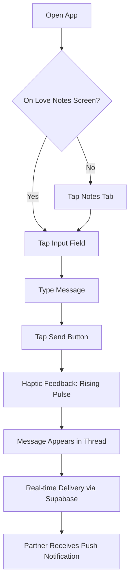
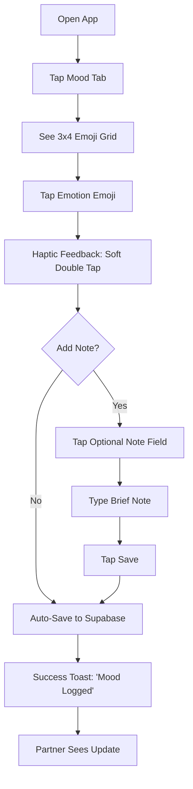
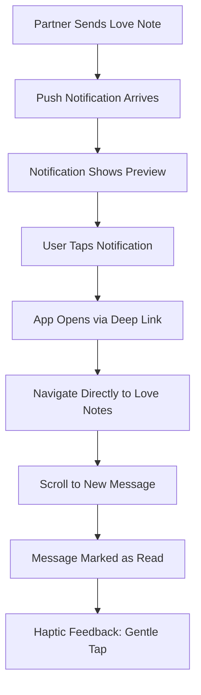
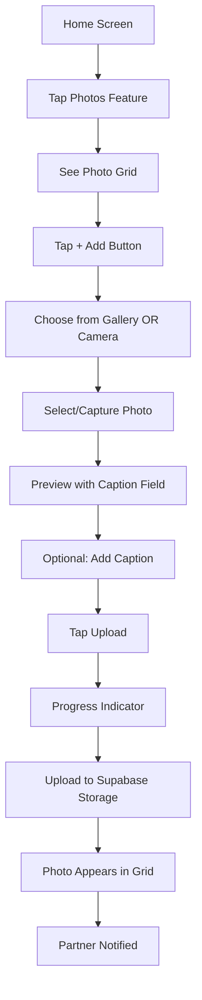
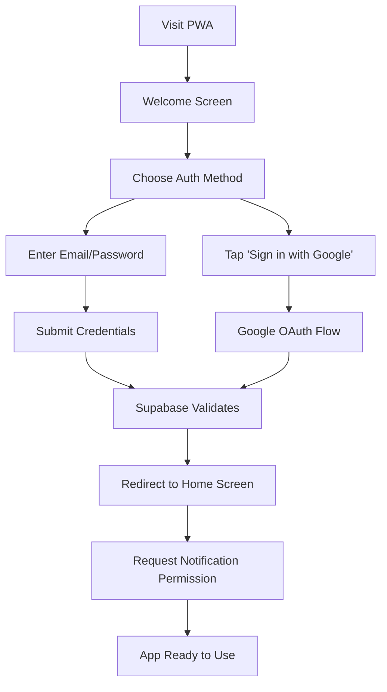

# My-Love UX Design Specification

_Created on 2025-11-16 by Frank_
_Generated using BMad Method - Create UX Design Workflow v1.0_

---

## Executive Summary

**My-Love Mobile** is a native mobile app (React Native + Expo) that brings the existing My-Love web experience to iOS and Android. Built for an intimate two-person relationship, this app transforms daily connection rituals into instant, in-pocket moments through real-time Love Notes, push notifications, mood tracking, and photo sharing.

**Vision:** Push notifications become something both partners **look forward to** receiving - not digital noise, but love notes in your pocket.

**Target Users:** Frank and his girlfriend - two partners who value full transparency, emotional connection, and reliable native mobile performance.

**Core Value Proposition:** Deeper connection through native mobile performance. Sub-second interactions transform daily rituals (morning mood logs, midday Love Notes, evening photo shares) from "when I get to my computer" into instant, always-accessible moments.

**Technical Foundation:**

- React Native + Expo with Expo Router
- Supabase (Auth, Database, Realtime, Storage)
- TanStack Query for smart caching
- MMKV for local preferences
- Online-first architecture with graceful degradation

---

## 1. Design System Foundation

### 1.1 Design System Choice

**Selected:** React Native Paper (Material Design 3) with heavy theming

**Rationale:**

- React Native Paper provides excellent accessibility defaults (WCAG AA compliant)
- Material Design 3 supports dynamic color theming (perfect for "Love" theme customization)
- Maintains native feel on both iOS and Android through adaptive styling
- Large component library covers all MVP needs (buttons, forms, cards, modals, navigation)
- Strong TypeScript support and active maintenance
- Customizable enough for romantic aesthetic while providing solid UX foundation

**Customization Strategy:**

- Override default Material colors with "Coral Heart" romantic palette
- Adjust border radius to 12-16px for softer, more intimate feel
- Customize elevation/shadows for warmer depth
- Add haptic feedback patterns not in base library

**Components Provided:**

- Buttons (primary, secondary, outlined, text)
- Text inputs with floating labels
- Cards with various layouts
- Bottom navigation
- Modal dialogs
- Snackbars/toasts
- Lists and list items
- Icons (via vector icons)

---

## 2. Core User Experience

### 2.1 Defining Experience

**Core Experience Statement:** "It's the app where you send love notes that arrive instantly in your partner's pocket."

**Primary User Action:** Sending and receiving Love Notes (real-time messaging)

- This is the ONE thing users will do most frequently
- Differentiates mobile app from web PWA
- Drives daily engagement through anticipation

**Critical Quick Action:** Mood Logging (< 5 seconds)

- Must be absolutely effortless: open → tap emoji → done
- No friction, no thinking, pure emotional expression
- Reinforces transparency and connection

**Core Experience Principles:**

| Principle       | Implementation                                                             | Rationale                                                    |
| --------------- | -------------------------------------------------------------------------- | ------------------------------------------------------------ |
| **Speed**       | Sub-second interactions: < 2s launch, < 5s mood log, < 2s message delivery | Native feel is non-negotiable; web-like delays destroy trust |
| **Guidance**    | Minimal - users know what they want                                        | Two-person intimate app; no onboarding confusion             |
| **Flexibility** | Focused options, clear actions                                             | Don't overwhelm with choices; curate the experience          |
| **Feedback**    | Satisfying haptics + warm visual cues                                      | Every action should feel emotionally rewarding               |

**Emotional Design Goals:**

- **Trust** through reliability: When you send, it arrives. Always.
- **Warmth** through visuals: "Love" theme makes every interaction personal
- **Intimacy** through simplicity: Two-person focus means no noise
- **Joy** through feedback: Haptics and animations make actions satisfying

### 2.2 Novel UX Patterns

**No truly novel patterns required.** The app uses established UX patterns:

1. **Real-time messaging** - Follows iMessage/WhatsApp patterns
2. **Emoji mood picker** - Similar to Daylio/mood tracking apps
3. **Photo gallery** - Standard grid with thumbnail previews
4. **Push notifications** - Native OS notification patterns
5. **Bottom tab navigation** - Standard mobile navigation

**Custom Implementation of Standard Patterns:**

- **Love Notes Chat:** Standard chat bubble UI with romantic color coding (coral for sent, light gray for received)
- **Mood Tracker Grid:** 3x4 emoji grid for 12 emotions, single tap selection, optional note field
- **Notification Deep Linking:** Tap notification → land directly in relevant screen (no intermediate navigation)
- **Haptic Language:** Success = soft double tap, Error = sharp single tap, Send = rising pulse

---

## 3. Visual Foundation

### 3.1 Color System

**Selected Theme:** Coral Heart (Theme #4 from exploration)

**Rationale:** Balances romantic warmth with modern clarity. Coral-red primary says "love" without being overly feminine, while neutral text colors ensure excellent readability for daily use.

**Primary Palette:**

| Role       | Color       | Hex       | Usage                                         |
| ---------- | ----------- | --------- | --------------------------------------------- |
| Primary    | Coral Red   | `#FF6B6B` | Main actions, key UI elements, brand identity |
| Secondary  | Soft Coral  | `#FFA8A8` | Supporting actions, hover states, accents     |
| Surface    | Blush White | `#FFF5F5` | Card backgrounds, elevated surfaces           |
| Dark       | Deep Coral  | `#C92A2A` | Text emphasis, headers, active states         |
| Background | Pure White  | `#FFFFFF` | Main background color                         |
| Text       | Warm Gray   | `#495057` | Body text, readable and warm                  |

**Semantic Colors:**

| State   | Color     | Hex       | Usage                                                      |
| ------- | --------- | --------- | ---------------------------------------------------------- |
| Success | Green     | `#51CF66` | Confirmations, sent successfully, positive feedback        |
| Warning | Yellow    | `#FCC419` | Caution, unsaved changes, attention needed                 |
| Error   | Coral Red | `#FF6B6B` | Errors, validation failures (same as primary for cohesion) |
| Info    | Blue      | `#339AF0` | Informational messages, neutral alerts                     |

**Dark Mode Palette:**

| Role       | Light Mode | Dark Mode | Notes                        |
| ---------- | ---------- | --------- | ---------------------------- |
| Background | `#FFFFFF`  | `#1A1A1A` | Warm dark, not pure black    |
| Surface    | `#FFF5F5`  | `#2D2D2D` | Slightly elevated            |
| Text       | `#495057`  | `#E0E0E0` | High contrast maintained     |
| Primary    | `#FF6B6B`  | `#FF8787` | Slightly lighter for dark bg |

### 3.2 Typography System

**Font Families:**

- **Headings:** System font (SF Pro on iOS, Roboto on Android) - native feel
- **Body:** System font - optimized for each platform
- **Monospace:** Platform default (for timestamps, codes)

**Type Scale:**

| Element | Size | Weight         | Line Height | Usage              |
| ------- | ---- | -------------- | ----------- | ------------------ |
| H1      | 32px | Bold (700)     | 1.2         | Screen titles      |
| H2      | 24px | SemiBold (600) | 1.3         | Section headers    |
| H3      | 20px | SemiBold (600) | 1.4         | Card titles        |
| Body    | 16px | Regular (400)  | 1.5         | Main content       |
| Small   | 14px | Regular (400)  | 1.4         | Secondary info     |
| Caption | 12px | Medium (500)   | 1.3         | Timestamps, labels |

### 3.3 Spacing System

**Base Unit:** 8px (standard mobile spacing)

**Spacing Scale:**

| Token | Value | Usage                          |
| ----- | ----- | ------------------------------ |
| xs    | 4px   | Tight spacing, inline elements |
| sm    | 8px   | Icon padding, small gaps       |
| md    | 16px  | Standard component padding     |
| lg    | 24px  | Section spacing, large gaps    |
| xl    | 32px  | Screen margins, major sections |
| 2xl   | 48px  | Hero sections, emphasis        |

**Layout Grid:**

- Single column layout (mobile-first)
- 16px horizontal margins
- 12px gap between cards/list items

**Interactive Visualizations:**

- Color Theme Explorer: [ux-color-themes.html](./ux-color-themes.html)

---

## 4. Design Direction

### 4.1 Chosen Design Approach

**Selected Direction:** Feature Hub (Direction #6) - Hybrid of Dashboard + List-Based Navigation

**Rationale:**

- Clear entry points for each feature (Love Notes, Mood, Photos, Messages)
- Scannable at-a-glance information (partner mood, new notes count, days together)
- Balances information density with clean organization
- Supports quick access patterns identified in journey mapping
- Bottom navigation provides consistent structure
- Scales well as features grow

**Layout Decisions:**

- **Navigation Pattern:** Bottom tab bar (4 tabs: Home, Notes, Mood, Settings)
- **Content Structure:** Single column, full-width cards
- **Content Organization:** Feature list with status badges
- **Hero Element:** Days Together counter at top of Home screen

**Hierarchy Decisions:**

- **Visual Density:** Balanced - key info visible without scrolling
- **Header Emphasis:** Bold coral color for section titles
- **Content Focus:** Status-driven (show "3 new notes", "Partner is Happy")

**Interaction Decisions:**

- **Primary Action Pattern:** Tap feature item → navigate to feature screen
- **Information Disclosure:** Show key status on home, full detail on tap
- **User Control:** Guided but not restrictive

**Visual Style Decisions:**

- **Weight:** Balanced - clear structure without overwhelming
- **Depth Cues:** Subtle elevation on cards (2-4px shadows)
- **Border Style:** Soft borders (1px #F0F0F0) or no borders with elevation
- **Corner Radius:** 12-16px for soft, approachable feel

**Key Screens:**

1. **Home/Dashboard** - Feature hub with status overview
2. **Love Notes** - Full-screen chat interface
3. **Mood Tracker** - Emoji grid with history
4. **Photo Gallery** - Grid view with upload button
5. **Daily Message** - Card with today's love message
6. **Settings** - Preferences and account management

**Interactive Mockups:**

- Design Direction Showcase: [ux-design-directions.html](./ux-design-directions.html)

---

## 5. User Journey Flows

### 5.1 Critical User Paths

**Journey 1: Send Love Note (Primary Action)**



**Key UX Decisions:**

- Input field always visible at bottom of chat screen
- Send button disabled until text is entered
- Optimistic UI: Message appears immediately with "sending" state
- Delivery confirmation: Check mark appears when delivered
- Error state: Red indicator if send fails, tap to retry

---

**Journey 2: Quick Mood Log (< 5 Seconds)**



**Key UX Decisions:**

- No intermediate screens or confirmations
- Large, easily tappable emoji buttons (48px minimum)
- Single tap selection - no second "confirm" action needed
- Optional note field collapsed by default
- Mood history scrollable below current selection
- Partner's current mood visible at top of screen

---

**Journey 3: Receive & View Push Notification**



**Key UX Decisions:**

- Rich notifications with message preview (configurable)
- Deep linking bypasses home screen entirely
- Auto-scroll to new message with highlight animation
- Read receipts update in real-time
- Notification badge clears automatically

---

**Journey 4: Upload Photo Memory**



**Key UX Decisions:**

- Grid view with thumbnail previews (3 columns)
- Tap photo to view full-screen with gestures
- Caption optional but encouraged
- Upload progress shown with percentage
- Photos sorted by date (newest first)
- Swipe to view next/previous photo

---

**Journey 5: First-Time Authentication**



**Key UX Decisions:**

- Email/password and Google OAuth options available
- Clear email/password input with validation
- Google OAuth for single-tap convenience
- Session persists via localStorage (Supabase manages)
- Error messages for invalid credentials or network issues

---

## 6. Component Library

### 6.1 Component Strategy

**React Native Paper Base Components (Pre-Built):**

| Component         | RNP Component             | Customization Needed                  |
| ----------------- | ------------------------- | ------------------------------------- |
| Buttons           | Button                    | Theme colors, haptic feedback wrapper |
| Text Inputs       | TextInput                 | Floating labels, coral accent colors  |
| Cards             | Card                      | Blush white surface, warm shadows     |
| Bottom Navigation | BottomNavigation          | 4 tabs, coral active indicator        |
| Modals/Dialogs    | Dialog                    | Soft corners, warm overlay            |
| Snackbars         | Snackbar                  | Success green, coral errors           |
| Lists             | List.Item                 | Feature hub items with badges         |
| Icons             | react-native-vector-icons | Heart, mood, camera, settings         |

**Custom Components Required:**

| Component             | Purpose                                    | Key Features                                                               |
| --------------------- | ------------------------------------------ | -------------------------------------------------------------------------- |
| `LoveNoteMessage`     | Chat bubble for Love Notes                 | Coral (sent) / Gray (received), timestamp, delivery status, haptic on send |
| `MoodEmojiPicker`     | 3x4 emoji grid for mood selection          | 12 emotions, single-tap select, haptic feedback, partner mood display      |
| `DaysTogetherCounter` | Hero element showing relationship duration | Large number, animated on load, coral accent                               |
| `FeatureListItem`     | Home screen feature entry point            | Icon, title, status badge (e.g., "3 new notes"), chevron                   |
| `PhotoThumbnail`      | Grid item for photo gallery                | Square crop, lazy load, tap to expand, caption overlay                     |
| `QuickActionButton`   | Floating action for common tasks           | Circular, coral background, haptic, tooltip                                |
| `NotificationBadge`   | Unread count indicator                     | Coral circle, white number, animate on change                              |
| `StatusIndicator`     | Online/offline connection status           | Green dot (online), yellow dot (connecting), red dot (offline)             |

**Component Architecture:**

```
src/components/
├── core/                    # Base themed components
│   ├── ThemedButton.tsx     # RNP Button + haptics
│   ├── ThemedCard.tsx       # RNP Card + warm shadows
│   └── ThemedInput.tsx      # RNP TextInput + floating label
├── love-notes/
│   ├── LoveNoteMessage.tsx  # Individual chat bubble
│   ├── MessageList.tsx      # Virtualized list of messages
│   └── MessageInput.tsx     # Input field + send button
├── mood/
│   ├── MoodEmojiPicker.tsx  # Emoji selection grid
│   ├── MoodHistoryItem.tsx  # Single mood entry
│   └── PartnerMoodDisplay.tsx # Show partner's current mood
├── photos/
│   ├── PhotoThumbnail.tsx   # Grid item
│   ├── PhotoViewer.tsx      # Full-screen with gestures
│   └── PhotoUploader.tsx    # Upload with progress
└── shared/
    ├── DaysTogetherCounter.tsx
    ├── FeatureListItem.tsx
    ├── NotificationBadge.tsx
    └── StatusIndicator.tsx
```

**Haptic Feedback Patterns:**

| Action          | Haptic Type      | Implementation                                                |
| --------------- | ---------------- | ------------------------------------------------------------- |
| Send Love Note  | Rising pulse     | `Haptics.impactAsync(ImpactFeedbackStyle.Medium)`             |
| Log Mood        | Soft double tap  | `Haptics.notificationAsync(NotificationFeedbackType.Success)` |
| Error           | Sharp single tap | `Haptics.notificationAsync(NotificationFeedbackType.Error)`   |
| Button Press    | Light tap        | `Haptics.impactAsync(ImpactFeedbackStyle.Light)`              |
| Pull to Refresh | Subtle feedback  | `Haptics.selectionAsync()`                                    |

**Design Token System:**

```typescript
// src/theme/tokens.ts
export const tokens = {
  colors: {
    primary: '#FF6B6B',
    secondary: '#FFA8A8',
    surface: '#FFF5F5',
    dark: '#C92A2A',
    background: '#FFFFFF',
    text: '#495057',
    success: '#51CF66',
    warning: '#FCC419',
    error: '#FF6B6B',
    info: '#339AF0',
  },
  spacing: {
    xs: 4,
    sm: 8,
    md: 16,
    lg: 24,
    xl: 32,
    xxl: 48,
  },
  borderRadius: {
    sm: 8,
    md: 12,
    lg: 16,
    full: 9999,
  },
  typography: {
    h1: { fontSize: 32, fontWeight: '700', lineHeight: 38.4 },
    h2: { fontSize: 24, fontWeight: '600', lineHeight: 31.2 },
    h3: { fontSize: 20, fontWeight: '600', lineHeight: 28 },
    body: { fontSize: 16, fontWeight: '400', lineHeight: 24 },
    small: { fontSize: 14, fontWeight: '400', lineHeight: 19.6 },
    caption: { fontSize: 12, fontWeight: '500', lineHeight: 15.6 },
  },
};
```

---

## 7. UX Pattern Decisions

### 7.1 Consistency Rules

**Button Behavior Standards:**

| Button Type      | Visual Style                  | Behavior                                                                          |
| ---------------- | ----------------------------- | --------------------------------------------------------------------------------- |
| Primary Action   | Filled coral (#FF6B6B)        | Haptic on press, disabled state with 50% opacity, loading spinner when processing |
| Secondary Action | Outlined coral                | Haptic on press, subtle hover/press state                                         |
| Destructive      | Filled coral (darker #C92A2A) | Confirmation dialog required, warning haptic                                      |
| Text/Link        | Underlined coral              | No haptic, immediate navigation                                                   |

**Form Behavior Standards:**

| Element        | Behavior                                                                                   |
| -------------- | ------------------------------------------------------------------------------------------ |
| Text Input     | Floating label, coral focus border, clear button on right, error message below             |
| Validation     | Real-time validation on blur, coral border + error text for invalid, green check for valid |
| Submit Button  | Disabled until valid, loading state with spinner, success feedback after completion        |
| Error Recovery | Shake animation + haptic on error, focus on first invalid field, clear error on edit       |

**Feedback Mechanisms:**

| Feedback Type | Implementation                                                       | Duration                  |
| ------------- | -------------------------------------------------------------------- | ------------------------- |
| Success Toast | Green background, check icon, bottom-center                          | 3 seconds, auto-dismiss   |
| Error Toast   | Coral background, X icon, bottom-center                              | 5 seconds, tap to dismiss |
| Loading State | Skeleton screens for content, spinner for actions                    | Until data loads          |
| Empty State   | Friendly illustration + helpful message + action button              | Persistent                |
| Offline State | Banner at top: "You're offline. Changes will sync when reconnected." | While offline             |

**Navigation Consistency:**

| Pattern            | Rule                                                                            |
| ------------------ | ------------------------------------------------------------------------------- |
| Bottom Tab         | Always visible (except modals), coral indicator on active tab, badge for unread |
| Back Navigation    | Left arrow icon, swipe from left edge (iOS), hardware back (Android)            |
| Modal Dismissal    | X button top-right, swipe down to dismiss, backdrop tap closes                  |
| Deep Links         | Navigate directly to content, maintain back stack for natural exit              |
| Screen Transitions | Slide from right (push), slide from bottom (modal), fade (tab switch)           |

**Data Loading Patterns:**

| Pattern         | When to Use                                                                      |
| --------------- | -------------------------------------------------------------------------------- |
| Skeleton Screen | Initial page load, content areas with known structure                            |
| Pull to Refresh | Lists (Love Notes, Mood History, Photos), home screen                            |
| Infinite Scroll | Message history, photo gallery                                                   |
| Optimistic UI   | Sending messages, logging moods - show immediately, sync in background           |
| Retry Logic     | Network failures: auto-retry 3x with exponential backoff, then show manual retry |

**Gesture Standards:**

| Gesture          | Action                                    |
| ---------------- | ----------------------------------------- |
| Single Tap       | Primary action (select, navigate, toggle) |
| Long Press       | Secondary menu (delete, share, copy)      |
| Swipe Left/Right | Photo navigation in full-screen viewer    |
| Swipe Down       | Dismiss modal, pull to refresh            |
| Pinch            | Zoom photos                               |
| Double Tap       | Zoom to fit / zoom in (photos only)       |

**Accessibility Patterns:**

| Pattern          | Implementation                                                                |
| ---------------- | ----------------------------------------------------------------------------- |
| Focus Management | Auto-focus on primary input, logical tab order, visible focus ring            |
| Screen Reader    | All interactive elements have accessibilityLabel, meaningful descriptions     |
| Touch Targets    | Minimum 44x44px for all interactive elements, 48px for critical actions       |
| Color Contrast   | WCAG AA minimum (4.5:1 for text, 3:1 for UI), tested with contrast checker    |
| Motion           | Respect prefers-reduced-motion, no auto-playing animations, user-controllable |

**Error State Hierarchy:**

1. **Inline Validation** - Field-level errors shown immediately below input
2. **Toast Notification** - Transient errors (network timeout, server error)
3. **Error Dialog** - Critical errors requiring user decision (session expired, auth failure)
4. **Full Screen Error** - Catastrophic failure (app crash, no network for extended period)

---

## 8. Responsive Design & Accessibility

### 8.1 Responsive Strategy

**Device Support Matrix:**

| Device Type    | Screen Size     | Layout Adjustments                                                       |
| -------------- | --------------- | ------------------------------------------------------------------------ |
| Small Phone    | 320-375px width | Compact spacing, smaller fonts (body: 14px), 2-column photo grid         |
| Standard Phone | 376-428px width | Default layout, standard spacing, 3-column photo grid                    |
| Large Phone    | 429-480px width | Expanded spacing, larger touch targets, 3-column photo grid              |
| Tablet         | 481px+ width    | Center content (max-width 480px), increased padding, 4-column photo grid |

**Breakpoint Strategy:**

```typescript
// src/theme/breakpoints.ts
export const breakpoints = {
  smallPhone: 320,
  phone: 376,
  largePhone: 429,
  tablet: 481,
};

export const useResponsiveValue = <T>(values: { small?: T; default: T; large?: T; tablet?: T }) => {
  const { width } = useWindowDimensions();
  if (width >= breakpoints.tablet) return values.tablet ?? values.default;
  if (width >= breakpoints.largePhone) return values.large ?? values.default;
  if (width <= breakpoints.smallPhone) return values.small ?? values.default;
  return values.default;
};
```

**Orientation Handling:**

| Orientation        | Behavior                                                            |
| ------------------ | ------------------------------------------------------------------- |
| Portrait (Primary) | Default layout, bottom navigation, vertical scrolling               |
| Landscape          | Lock to portrait for consistency (intimate app, portrait-optimized) |
| Exception          | Photo viewer allows landscape with pinch-to-zoom                    |

**Safe Area Management:**

- **Top Safe Area**: Status bar + notch on iOS, handled by SafeAreaView
- **Bottom Safe Area**: Home indicator on iOS, handled by SafeAreaView
- **Keyboard Avoidance**: KeyboardAvoidingView for forms, auto-scroll to focused input
- **System Bars**: Respect system UI (dark mode follows system preference)

**Accessibility Standards (WCAG 2.1 AA):**

| Requirement          | Implementation                                              |
| -------------------- | ----------------------------------------------------------- |
| **Color Contrast**   | All text: 4.5:1 minimum, UI elements: 3:1 minimum           |
| **Text Scaling**     | Support system font scaling up to 200%, layouts don't break |
| **Touch Targets**    | Minimum 44x44px (48px recommended for primary actions)      |
| **Focus Indicators** | Visible 2px coral outline on focused elements               |
| **Screen Reader**    | VoiceOver (iOS) / TalkBack (Android) fully supported        |
| **Reduce Motion**    | Honor system setting, disable animations when enabled       |
| **High Contrast**    | Support system high contrast mode                           |

**Screen Reader Labels:**

```typescript
// Example: Love Note Message
<View
  accessible={true}
  accessibilityLabel={`Love note from ${sender}: ${message}`}
  accessibilityHint="Double tap to open message options"
  accessibilityRole="button"
>
  <LoveNoteMessage {...props} />
</View>

// Example: Mood Emoji
<Pressable
  accessible={true}
  accessibilityLabel={`Log mood as ${emojiName}`}
  accessibilityHint="Double tap to select this mood"
  accessibilityRole="button"
>
  <Emoji type={emojiType} />
</Pressable>
```

**Dynamic Type Support:**

```typescript
// src/theme/typography.ts
import { PixelRatio } from 'react-native';

export const scaledFontSize = (baseSize: number) => {
  const scale = PixelRatio.getFontScale();
  return Math.round(baseSize * Math.min(scale, 2)); // Cap at 2x to prevent layout breaks
};
```

**Performance Considerations:**

| Optimization   | Implementation                                           |
| -------------- | -------------------------------------------------------- |
| Image Loading  | Progressive JPEG, lazy load off-screen, placeholder blur |
| List Rendering | FlashList for virtualized lists (Love Notes, Photo Grid) |
| Animation      | Use native driver for 60fps, avoid layout animations     |
| Bundle Size    | Tree-shaking, code splitting by route (Expo Router)      |
| Memory         | Unload off-screen images, limit cached messages          |

**Offline Behavior:**

| State        | User Experience                                                         |
| ------------ | ----------------------------------------------------------------------- |
| Online       | Full functionality, real-time sync                                      |
| Connecting   | Yellow status indicator, "Connecting..." banner                         |
| Offline      | Red status indicator, "Offline" banner, queued actions, read-only cache |
| Reconnecting | Auto-sync queued actions, show sync progress, confirm completion        |

**Testing Strategy:**

- **Devices**: iPhone SE (small), iPhone 14 (standard), iPhone 14 Pro Max (large), iPad Mini (tablet)
- **Accessibility Testing**: VoiceOver on, Dynamic Type at maximum, Reduce Motion on, High Contrast on
- **Performance Testing**: Low-end device simulation, slow network throttling
- **Orientation Testing**: Portrait lock respected, photo viewer landscape support

---

## 9. Implementation Guidance

### 9.1 Completion Summary

**UX Design Specification Coverage:**

| Section           | Status      | Key Decisions                                              |
| ----------------- | ----------- | ---------------------------------------------------------- |
| Design System     | ✅ Complete | React Native Paper with Coral Heart theming                |
| Core Experience   | ✅ Complete | Love Notes as primary action, Mood logging as quick action |
| Visual Foundation | ✅ Complete | #FF6B6B primary, 8px spacing, system fonts                 |
| Design Direction  | ✅ Complete | Feature Hub with bottom tab navigation                     |
| User Journeys     | ✅ Complete | 5 critical paths with Mermaid diagrams                     |
| Component Library | ✅ Complete | 8 custom components + RNP base library                     |
| UX Patterns       | ✅ Complete | Consistent interaction rules defined                       |
| Responsive/A11y   | ✅ Complete | WCAG 2.1 AA, multi-device support                          |

**Core Deliverables Generated:**

1. **ux-design-specification.md** (this document)
   - Comprehensive UX decisions with rationale
   - All sections aligned with PRD requirements
   - Technical implementation guidance included

2. **ux-color-themes.html**
   - Interactive theme explorer with 4 options
   - Live component previews
   - Click-to-copy hex codes
   - Recommended: Coral Heart (#4)

3. **ux-design-directions.html**
   - 6 complete design direction mockups
   - Phone frame visualization
   - Keyboard navigation support
   - Recommended: Feature Hub (#6)

**Alignment with PRD Requirements:**

| PRD Requirement                | UX Implementation                         |
| ------------------------------ | ----------------------------------------- |
| "Love" theme visual identity   | Coral Heart color system (#FF6B6B)        |
| Dark mode support              | Dark mode palette defined                 |
| Haptic feedback                | 5 distinct haptic patterns specified      |
| Sub-second interactions        | Optimistic UI, native performance targets |
| Push notification deep linking | Journey 3 with direct navigation          |
| Mood tracking < 5 seconds      | Journey 2 with single-tap selection       |
| 12 emotions                    | 3x4 emoji grid component                  |
| Photo sharing                  | Journey 4 with caption support            |
| Real-time messaging            | Love Notes with Supabase Realtime         |

**Technical Foundation Established:**

- **Design System**: React Native Paper (Material Design 3)
- **Component Architecture**: Modular structure with shared design tokens
- **Haptic Language**: Consistent feedback patterns across interactions
- **Navigation Pattern**: 4-tab bottom navigation (Home, Notes, Mood, Settings)
- **State Management**: TanStack Query with optimistic updates
- **Accessibility**: WCAG 2.1 AA compliant from foundation

**Implementation Priorities:**

1. **Phase 1 - Core Infrastructure**
   - Set up React Native Paper with custom theme
   - Implement design token system
   - Create base themed components (ThemedButton, ThemedCard, ThemedInput)

2. **Phase 2 - Primary Features**
   - Love Notes messaging with LoveNoteMessage component
   - Mood logging with MoodEmojiPicker component
   - Bottom navigation with tab badge support

3. **Phase 3 - Supporting Features**
   - Photo gallery with PhotoThumbnail and PhotoViewer
   - Days Together counter
   - Push notification integration with deep linking

4. **Phase 4 - Polish**
   - Haptic feedback integration
   - Loading states and skeleton screens
   - Error handling and offline support
   - Accessibility testing and refinement

**Risks & Mitigation:**

| Risk                               | Mitigation Strategy                                  |
| ---------------------------------- | ---------------------------------------------------- |
| React Native Paper limitations     | Custom components ready for override                 |
| Performance with real-time updates | FlashList virtualization, optimistic UI              |
| Cross-platform consistency         | Platform-specific testing matrix defined             |
| Accessibility compliance           | Testing strategy with specific device configurations |

**Success Metrics:**

- **Performance**: App launch < 2s, mood log < 5s, message send < 2s
- **Accessibility**: WCAG 2.1 AA compliance verified
- **User Satisfaction**: Push notifications anticipated, not annoying
- **Reliability**: Graceful offline handling, automatic sync recovery

**Next Steps:**

This UX Design Specification is ready to inform:

- Solution Architecture decisions
- Epic and story breakdown
- Component development sprints
- QA testing criteria

The interactive HTML deliverables provide visual reference for development, ensuring design consistency throughout implementation.

---

## Appendix

### Related Documents

- Product Requirements: `docs/prd.md`
- Brainstorming Session: `docs/brainstorming-session-results-2025-11-16.md`

### Core Interactive Deliverables

This UX Design Specification was created through visual collaboration:

- **Color Theme Visualizer**: docs/ux-color-themes.html
  - Interactive HTML showing all color theme options explored
  - Live UI component examples in each theme
  - Side-by-side comparison and semantic color usage

- **Design Direction Mockups**: docs/ux-design-directions.html
  - Interactive HTML with 6-8 complete design approaches
  - Full-screen mockups of key screens
  - Design philosophy and rationale for each direction

### Optional Enhancement Deliverables

_This section will be populated if additional UX artifacts are generated through follow-up workflows._

<!-- Additional deliverables added here by other workflows -->

### Next Steps & Follow-Up Workflows

This UX Design Specification can serve as input to:

- **Wireframe Generation Workflow** - Create detailed wireframes from user flows
- **Figma Design Workflow** - Generate Figma files via MCP integration
- **Interactive Prototype Workflow** - Build clickable HTML prototypes
- **Component Showcase Workflow** - Create interactive component library
- **AI Frontend Prompt Workflow** - Generate prompts for v0, Lovable, Bolt, etc.
- **Solution Architecture Workflow** - Define technical architecture with UX context

### Version History

| Date       | Version | Changes                         | Author |
| ---------- | ------- | ------------------------------- | ------ |
| 2025-11-16 | 1.0     | Initial UX Design Specification | Frank  |

---

_This UX Design Specification was created through collaborative design facilitation, not template generation. All decisions were made with user input and are documented with rationale._
