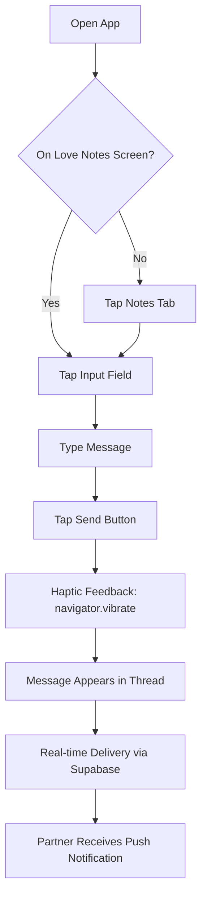
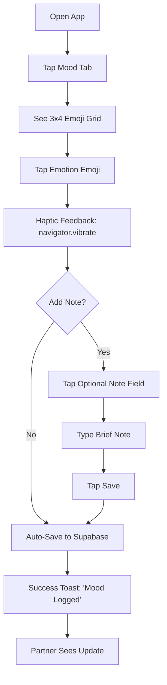
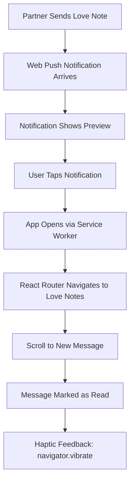
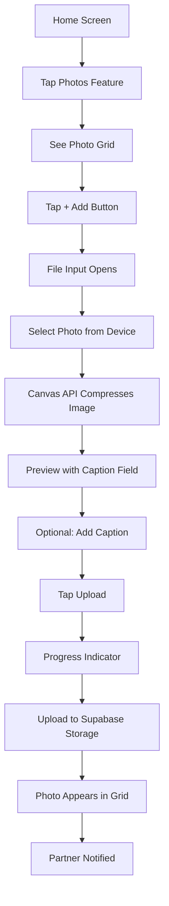
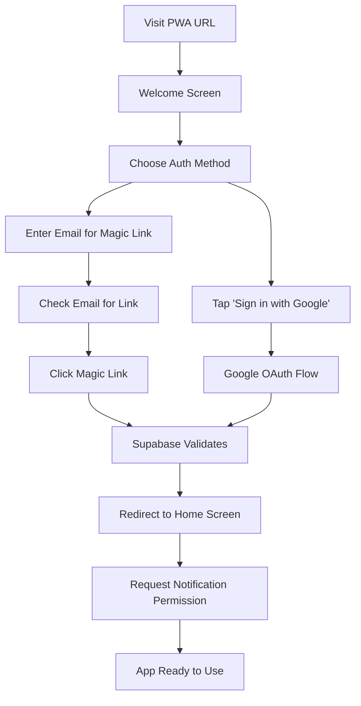
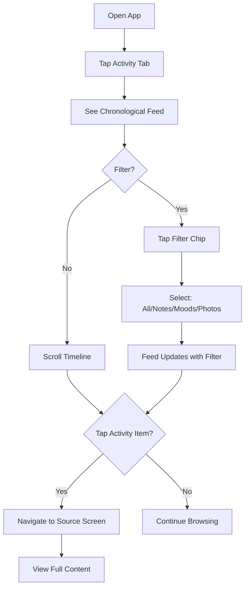

# My-Love UX Design Specification

_Created on 2025-11-16 by Frank_
_Updated on 2025-12-08 for PWA Web-First Architecture_
_Generated using BMad Method - Create UX Design Workflow v1.0_

---

## Executive Summary

**My-Love PWA** is a Progressive Web App (React 19 + Vite + Tailwind CSS) that delivers an intimate two-person relationship experience across desktop and mobile browsers. Built for full transparency and daily connection, this app transforms relationship rituals into instant, accessible moments through real-time Love Notes, push notifications, mood tracking, and photo sharing.

**Vision:** Push notifications become something both partners **look forward to** receiving - not digital noise, but love notes in your browser.

**Target Users:** Frank and his girlfriend - two partners who value full transparency, emotional connection, and reliable cross-device access.

**Core Value Proposition:** Deeper connection through instant accessibility. Sub-second interactions transform daily rituals (morning mood logs, midday Love Notes, evening photo shares) from "when I get to my computer" into instant, always-accessible moments from any device.

**Technical Foundation:**

- React 19 + Vite 7 with PWA support
- Tailwind CSS 4 for styling
- Zustand for state management with persistence
- Supabase (Auth, Database, Realtime, Storage)
- Web Push API for notifications
- localStorage/IndexedDB for local preferences
- Online-first architecture with graceful degradation

---

## 1. Design System Foundation

### 1.1 Design System Choice

**Selected:** Tailwind CSS 4 + Custom Component Library

**Rationale:**

- Tailwind provides utility-first styling with excellent responsive design support
- Custom components ensure consistent romantic aesthetic across all screens
- Full control over design tokens and theming (Coral Heart palette)
- Excellent TypeScript support through class variance authority (CVA)
- React 19 compatibility with modern patterns
- Framer Motion integration for delightful animations

**Customization Strategy:**

- Custom CSS variables for "Coral Heart" romantic palette
- Consistent border-radius (rounded-xl/2xl) for softer, intimate feel
- Tailwind dark mode with class strategy for theme switching
- Web Vibration API patterns for haptic feedback

**Components Provided (Custom):**

- Buttons (primary, secondary, outlined, text) with haptic feedback
- Text inputs with floating labels and validation states
- Cards with warm shadows and blush backgrounds
- Bottom navigation (mobile) / Sidebar (desktop)
- Modal dialogs with backdrop blur
- Toast notifications (react-hot-toast integration)
- Lists and list items with status badges
- Icons via Lucide React

---

## 2. Core User Experience

### 2.1 Defining Experience

**Core Experience Statement:** "It's the app where you send love notes that arrive instantly in your partner's browser."

**Primary User Action:** Sending and receiving Love Notes (real-time messaging)

- This is the ONE thing users will do most frequently
- Differentiates the experience through real-time Supabase subscriptions
- Drives daily engagement through anticipation

**Critical Quick Action:** Mood Logging (< 5 seconds)

- Must be absolutely effortless: open → tap emoji → done
- No friction, no thinking, pure emotional expression
- Reinforces transparency and connection

**Core Experience Principles:**

| Principle       | Implementation                                                             | Rationale                                                     |
| --------------- | -------------------------------------------------------------------------- | ------------------------------------------------------------- |
| **Speed**       | Sub-second interactions: < 2s launch, < 5s mood log, < 2s message delivery | Native feel is non-negotiable; slow responses destroy trust   |
| **Guidance**    | Minimal - users know what they want                                        | Two-person intimate app; no onboarding confusion              |
| **Flexibility** | Focused options, clear actions                                             | Don't overwhelm with choices; curate the experience           |
| **Feedback**    | Satisfying haptics + warm visual cues                                      | Every action should feel emotionally rewarding                |

**Emotional Design Goals:**

- **Trust** through reliability: When you send, it arrives. Always.
- **Warmth** through visuals: "Love" theme makes every interaction personal
- **Intimacy** through simplicity: Two-person focus means no noise
- **Joy** through feedback: Vibrations and animations make actions satisfying

### 2.2 Novel UX Patterns

**No truly novel patterns required.** The app uses established UX patterns:

1. **Real-time messaging** - Follows iMessage/WhatsApp patterns
2. **Emoji mood picker** - Similar to Daylio/mood tracking apps
3. **Photo gallery** - Standard grid with thumbnail previews
4. **Push notifications** - Web Push API patterns
5. **Bottom tab navigation** - Standard mobile navigation (responsive sidebar on desktop)

**Custom Implementation of Standard Patterns:**

- **Love Notes Chat:** Standard chat bubble UI with romantic color coding (coral for sent, light gray for received)
- **Mood Tracker Grid:** 3x4 emoji grid for 12 emotions, single tap selection, optional note field
- **Notification Deep Linking:** Tap notification → land directly in relevant screen (via React Router)
- **Haptic Language:** Success = soft double tap, Error = sharp single tap, Send = rising pulse

---

## 3. Visual Foundation

### 3.1 Color System

**Selected Theme:** Coral Heart (Theme #4 from exploration)

**Rationale:** Balances romantic warmth with modern clarity. Coral-red primary says "love" without being overly feminine, while neutral text colors ensure excellent readability for daily use.

**Primary Palette:**

| Role       | Color       | Hex       | Tailwind Class | Usage                                         |
| ---------- | ----------- | --------- | -------------- | --------------------------------------------- |
| Primary    | Coral Red   | `#FF6B6B` | `coral-500`    | Main actions, key UI elements, brand identity |
| Secondary  | Soft Coral  | `#FFA8A8` | `coral-300`    | Supporting actions, hover states, accents     |
| Surface    | Blush White | `#FFF5F5` | `rose-50`      | Card backgrounds, elevated surfaces           |
| Dark       | Deep Coral  | `#C92A2A` | `coral-700`    | Text emphasis, headers, active states         |
| Background | Pure White  | `#FFFFFF` | `white`        | Main background color                         |
| Text       | Warm Gray   | `#495057` | `gray-700`     | Body text, readable and warm                  |

**Semantic Colors:**

| State   | Color     | Hex       | Tailwind Class | Usage                                                      |
| ------- | --------- | --------- | -------------- | ---------------------------------------------------------- |
| Success | Green     | `#51CF66` | `green-400`    | Confirmations, sent successfully, positive feedback        |
| Warning | Yellow    | `#FCC419` | `amber-400`    | Caution, unsaved changes, attention needed                 |
| Error   | Coral Red | `#FF6B6B` | `coral-500`    | Errors, validation failures (same as primary for cohesion) |
| Info    | Blue      | `#339AF0` | `blue-500`     | Informational messages, neutral alerts                     |

**Dark Mode Palette:**

| Role       | Light Mode | Dark Mode | Tailwind Dark   | Notes                        |
| ---------- | ---------- | --------- | --------------- | ---------------------------- |
| Background | `#FFFFFF`  | `#1A1A1A` | `dark:bg-[#1A1A1A]` | Warm dark, not pure black |
| Surface    | `#FFF5F5`  | `#2D2D2D` | `dark:bg-[#2D2D2D]` | Slightly elevated         |
| Text       | `#495057`  | `#E0E0E0` | `dark:text-gray-200` | High contrast maintained |
| Primary    | `#FF6B6B`  | `#FF8787` | `dark:text-coral-400` | Slightly lighter for dark bg |

### 3.2 Typography System

**Font Families:**

- **Headings:** System font stack (Inter, SF Pro, Segoe UI, Roboto) - optimized for web
- **Body:** System font stack - crisp rendering across browsers
- **Monospace:** Platform default (for timestamps, codes)

**Type Scale (Tailwind Classes):**

| Element | Size | Weight         | Line Height | Tailwind Class                    | Usage              |
| ------- | ---- | -------------- | ----------- | --------------------------------- | ------------------ |
| H1      | 32px | Bold (700)     | 1.2         | `text-3xl font-bold leading-tight` | Screen titles      |
| H2      | 24px | SemiBold (600) | 1.3         | `text-2xl font-semibold`          | Section headers    |
| H3      | 20px | SemiBold (600) | 1.4         | `text-xl font-semibold`           | Card titles        |
| Body    | 16px | Regular (400)  | 1.5         | `text-base`                       | Main content       |
| Small   | 14px | Regular (400)  | 1.4         | `text-sm`                         | Secondary info     |
| Caption | 12px | Medium (500)   | 1.3         | `text-xs font-medium`             | Timestamps, labels |

### 3.3 Spacing System

**Base Unit:** 8px (Tailwind's default spacing scale)

**Spacing Scale:**

| Token | Value | Tailwind | Usage                          |
| ----- | ----- | -------- | ------------------------------ |
| xs    | 4px   | `p-1`    | Tight spacing, inline elements |
| sm    | 8px   | `p-2`    | Icon padding, small gaps       |
| md    | 16px  | `p-4`    | Standard component padding     |
| lg    | 24px  | `p-6`    | Section spacing, large gaps    |
| xl    | 32px  | `p-8`    | Screen margins, major sections |
| 2xl   | 48px  | `p-12`   | Hero sections, emphasis        |

**Layout Grid:**

- Mobile: Single column layout, 16px horizontal margins (`px-4`)
- Tablet: Two-column grid where appropriate (`md:grid-cols-2`)
- Desktop: Centered content with max-width (`max-w-2xl mx-auto`)
- Gap between cards/list items: 12px (`gap-3`)

**Interactive Visualizations:**

- Color Theme Explorer: [ux-color-themes.html](./ux-color-themes.html)

---

## 4. Design Direction

### 4.1 Chosen Design Approach

**Selected Direction:** Feature Hub (Direction #6) - Hybrid of Dashboard + List-Based Navigation

**Rationale:**

- Clear entry points for each feature (Love Notes, Mood, Photos, Messages)
- Scannable at-a-glance information (partner mood, new notes count, days together)
- Balances information density with clean organization
- Supports quick access patterns identified in journey mapping
- Bottom navigation (mobile) / Sidebar (desktop) provides consistent structure
- Scales well as features grow

**Layout Decisions:**

- **Navigation Pattern:** Bottom tab bar on mobile (5 tabs: Home, Notes, Activity, Mood, Settings), Sidebar on desktop
- **Content Structure:** Single column on mobile, max-width centered on desktop
- **Content Organization:** Feature list with status badges
- **Hero Element:** Days Together counter at top of Home screen

**Hierarchy Decisions:**

- **Visual Density:** Balanced - key info visible without scrolling
- **Header Emphasis:** Bold coral color for section titles
- **Content Focus:** Status-driven (show "3 new notes", "Partner is Happy")

**Interaction Decisions:**

- **Primary Action Pattern:** Tap/click feature item → navigate to feature screen
- **Information Disclosure:** Show key status on home, full detail on navigation
- **User Control:** Guided but not restrictive

**Visual Style Decisions:**

- **Weight:** Balanced - clear structure without overwhelming
- **Depth Cues:** Subtle elevation on cards (`shadow-sm` to `shadow-md`)
- **Border Style:** Soft borders or no borders with elevation
- **Corner Radius:** `rounded-xl` to `rounded-2xl` for soft, approachable feel

**Key Screens:**

1. **Home/Dashboard** - Feature hub with status overview
2. **Love Notes** - Full-screen chat interface
3. **Mood Tracker** - Emoji grid with history
4. **Photo Gallery** - Grid view with upload button
5. **Daily Message** - Card with today's love message
6. **Activity Feed** - Relationship timeline and notifications history
7. **Settings** - Preferences and account management

**Interactive Mockups:**

- Design Direction Showcase: [ux-design-directions.html](./ux-design-directions.html)

---

## 5. User Journey Flows

### 5.1 Critical User Paths

**Journey 1: Send Love Note (Primary Action)**


```mermaid
graph TD
    A[Open App] --> B{On Love Notes Screen?}
    B -->|Yes| C[Tap Input Field]
    B -->|No| D[Tap Notes Tab]
    D --> C
    C --> E[Type Message]
    E --> F[Tap Send Button]
    F --> G[Haptic Feedback: navigator.vibrate]
    G --> H[Message Appears in Thread]
    H --> I[Real-time Delivery via Supabase]
    I --> J[Partner Receives Push Notification]
```

**Key UX Decisions:**

- Input field always visible at bottom of chat screen
- Send button disabled until text is entered
- Optimistic UI: Message appears immediately with "sending" state
- Delivery confirmation: Check mark appears when delivered
- Error state: Red indicator if send fails, tap to retry

---

**Journey 2: Quick Mood Log (< 5 Seconds)**


```mermaid
graph TD
    A[Open App] --> B[Tap Mood Tab]
    B --> C[See 3x4 Emoji Grid]
    C --> D[Tap Emotion Emoji]
    D --> E[Haptic Feedback: navigator.vibrate]
    E --> F{Add Note?}
    F -->|No| G[Auto-Save to Supabase]
    F -->|Yes| H[Tap Optional Note Field]
    H --> I[Type Brief Note]
    I --> J[Tap Save]
    J --> G
    G --> K[Success Toast: 'Mood Logged']
    K --> L[Partner Sees Update]
```

**Key UX Decisions:**

- No intermediate screens or confirmations
- Large, easily tappable emoji buttons (48px minimum)
- Single tap selection - no second "confirm" action needed
- Optional note field collapsed by default
- Mood history scrollable below current selection
- Partner's current mood visible at top of screen

---

**Journey 3: Receive & View Push Notification**


```mermaid
graph TD
    A[Partner Sends Love Note] --> B[Web Push Notification Arrives]
    B --> C[Notification Shows Preview]
    C --> D[User Taps Notification]
    D --> E[App Opens via Service Worker]
    E --> F[React Router Navigates to Love Notes]
    F --> G[Scroll to New Message]
    G --> H[Message Marked as Read]
    H --> I[Haptic Feedback: navigator.vibrate]
```

**Key UX Decisions:**

- Rich notifications with message preview (Web Push API)
- Deep linking via React Router bypasses home screen entirely
- Auto-scroll to new message with highlight animation
- Read receipts update in real-time
- Notification badge clears automatically

---

**Journey 4: Upload Photo Memory**


```mermaid
graph TD
    A[Home Screen] --> B[Tap Photos Feature]
    B --> C[See Photo Grid]
    C --> D[Tap + Add Button]
    D --> E[File Input Opens]
    E --> F[Select Photo from Device]
    F --> G[Canvas API Compresses Image]
    G --> H[Preview with Caption Field]
    H --> I[Optional: Add Caption]
    I --> J[Tap Upload]
    J --> K[Progress Indicator]
    K --> L[Upload to Supabase Storage]
    L --> M[Photo Appears in Grid]
    M --> N[Partner Notified]
```

**Key UX Decisions:**

- Grid view with thumbnail previews (3 columns mobile, 4+ desktop)
- Tap photo to view full-screen with gestures
- Caption optional but encouraged
- Upload progress shown with percentage
- Photos sorted by date (newest first)
- Swipe to view next/previous photo

---

**Journey 5: First-Time Authentication**


```mermaid
graph TD
    A[Visit PWA URL] --> B[Welcome Screen]
    B --> C[Choose Auth Method]
    C --> D1[Enter Email for Magic Link]
    C --> D2[Tap 'Sign in with Google']
    D1 --> E[Check Email for Link]
    E --> F[Click Magic Link]
    D2 --> G[Google OAuth Flow]
    F --> H[Supabase Validates]
    G --> H
    H --> I[Redirect to Home Screen]
    I --> J[Request Notification Permission]
    J --> K[App Ready to Use]
```

**Key UX Decisions:**

- Magic Link (passwordless) and Google OAuth options available
- Clear email input with validation
- Google OAuth for single-tap convenience
- Session persists via Supabase (localStorage)
- Error messages for invalid credentials or network issues

---

**Journey 6: Browse Activity Feed**


```mermaid
graph TD
    A[Open App] --> B[Tap Activity Tab]
    B --> C[See Chronological Feed]
    C --> D{Filter?}
    D -->|No| E[Scroll Timeline]
    D -->|Yes| F[Tap Filter Chip]
    F --> G[Select: All/Notes/Moods/Photos]
    G --> H[Feed Updates with Filter]
    E --> I{Tap Activity Item?}
    H --> I
    I -->|Yes| J[Navigate to Source Screen]
    I -->|No| K[Continue Browsing]
    J --> L[View Full Content]
```

**Key UX Decisions:**

- Reverse chronological order (newest first)
- Activity types distinguished by icon: 💌 Notes, 🌸 Moods, 📸 Photos, ✨ Daily Message
- Tap any item to navigate directly to that content
- Filter chips at top: All (default), Notes, Moods, Photos
- Timestamps: "Just now", "2h ago", "Yesterday", then full date
- Pull-to-refresh to fetch latest activities
- Infinite scroll with virtualization for performance
- Mark as read: Items dim after being viewed

---

## 6. Component Library

### 6.1 Component Strategy

**Tailwind + Custom Components (React 19):**

| Component         | Implementation                        | Customization Needed                         |
| ----------------- | ------------------------------------- | -------------------------------------------- |
| Buttons           | Custom with Tailwind + CVA            | Coral variants, haptic feedback wrapper      |
| Text Inputs       | Custom with floating labels           | Coral accent colors, validation states       |
| Cards             | Custom Tailwind                       | Blush white surface, warm shadows            |
| Bottom Navigation | Custom responsive component           | 5 tabs, coral active indicator               |
| Modals/Dialogs    | Headless UI or custom                 | Soft corners, backdrop blur                  |
| Toasts            | react-hot-toast                       | Success green, coral errors                  |
| Lists             | Custom with Tailwind                  | Feature hub items with badges                |
| Icons             | Lucide React                          | Heart, mood, camera, settings                |

**Custom Components Required:**

| Component             | Purpose                                    | Key Features                                                               |
| --------------------- | ------------------------------------------ | -------------------------------------------------------------------------- |
| `LoveNoteMessage`     | Chat bubble for Love Notes                 | Coral (sent) / Gray (received), timestamp, delivery status, haptic on send |
| `MoodEmojiPicker`     | 3x4 emoji grid for mood selection          | 12 emotions, single-tap select, haptic feedback, partner mood display      |
| `DaysTogetherCounter` | Hero element showing relationship duration | Large number, animated on load (Framer Motion), coral accent               |
| `FeatureListItem`     | Home screen feature entry point            | Icon, title, status badge (e.g., "3 new notes"), chevron                   |
| `PhotoThumbnail`      | Grid item for photo gallery                | Square crop, lazy load, tap to expand, caption overlay                     |
| `QuickActionButton`   | Floating action for common tasks           | Circular, coral background, haptic, tooltip                                |
| `NotificationBadge`   | Unread count indicator                     | Coral circle, white number, animate on change                              |
| `StatusIndicator`     | Online/offline connection status           | Green dot (online), yellow dot (connecting), red dot (offline)             |
| `ActivityItem`        | Timeline entry for Activity Feed           | Icon by type (💌📸🌸), partner name, timestamp, tap to navigate            |
| `ActivityFilter`      | Filter toggle for Activity Feed            | Chip buttons: All, Notes, Moods, Photos; single-select                     |

**Component Architecture:**

```
src/components/
├── ui/                       # Base styled components
│   ├── Button.tsx            # Custom button with haptics
│   ├── Card.tsx              # Card with warm shadows
│   ├── Input.tsx             # Text input with floating label
│   └── Toast.tsx             # Toast notification wrapper
├── love-notes/
│   ├── LoveNoteMessage.tsx   # Individual chat bubble
│   ├── MessageList.tsx       # Virtualized list (react-window)
│   └── MessageInput.tsx      # Input field + send button
├── mood/
│   ├── MoodEmojiPicker.tsx   # Emoji selection grid
│   ├── MoodHistoryItem.tsx   # Single mood entry
│   └── PartnerMoodDisplay.tsx # Show partner's current mood
├── photos/
│   ├── PhotoThumbnail.tsx    # Grid item
│   ├── PhotoViewer.tsx       # Full-screen with gestures
│   └── PhotoUploader.tsx     # Upload with progress
├── activity/
│   ├── ActivityItem.tsx      # Single timeline entry with icon
│   ├── ActivityList.tsx      # Chronological feed (Framer Motion)
│   └── ActivityFilter.tsx    # Filter by type (notes, moods, photos)
└── shared/
    ├── DaysTogetherCounter.tsx
    ├── FeatureListItem.tsx
    ├── NotificationBadge.tsx
    └── StatusIndicator.tsx
```

**Haptic Feedback Patterns (Web Vibration API):**

| Action          | Haptic Type      | Implementation                        |
| --------------- | ---------------- | ------------------------------------- |
| Send Love Note  | Rising pulse     | `navigator.vibrate([50])`             |
| Log Mood        | Soft double tap  | `navigator.vibrate([15, 15])`         |
| Error           | Sharp single tap | `navigator.vibrate([100, 50, 100])`   |
| Button Press    | Light tap        | `navigator.vibrate([10])`             |
| Receive Message | Gentle tap       | `navigator.vibrate([30])`             |

**Design Token System:**

```typescript
// src/lib/theme/tokens.ts
export const tokens = {
  colors: {
    primary: '#FF6B6B',
    secondary: '#FFA8A8',
    surface: '#FFF5F5',
    dark: '#C92A2A',
    background: '#FFFFFF',
    text: '#495057',
    success: '#51CF66',
    warning: '#FCC419',
    error: '#FF6B6B',
    info: '#339AF0',
  },
  spacing: {
    xs: '0.25rem',  // 4px
    sm: '0.5rem',   // 8px
    md: '1rem',     // 16px
    lg: '1.5rem',   // 24px
    xl: '2rem',     // 32px
    '2xl': '3rem',  // 48px
  },
  borderRadius: {
    sm: '0.5rem',   // 8px
    md: '0.75rem',  // 12px
    lg: '1rem',     // 16px
    full: '9999px',
  },
} as const;

// Tailwind CSS @theme extension in src/index.css
// @theme {
//   --color-coral-500: #FF6B6B;
//   --color-coral-300: #FFA8A8;
//   --color-coral-700: #C92A2A;
// }
```

---

## 7. UX Pattern Decisions

### 7.1 Consistency Rules

**Button Behavior Standards:**

| Button Type      | Visual Style (Tailwind)                                      | Behavior                                                                          |
| ---------------- | ------------------------------------------------------------ | --------------------------------------------------------------------------------- |
| Primary Action   | `bg-coral-500 text-white hover:bg-coral-600`                 | Haptic on press, disabled state with opacity-50, loading spinner when processing  |
| Secondary Action | `border-coral-500 text-coral-500 hover:bg-coral-50`          | Haptic on press, subtle hover state                                               |
| Destructive      | `bg-coral-700 text-white`                                    | Confirmation dialog required, warning haptic                                      |
| Text/Link        | `text-coral-500 underline hover:text-coral-700`              | No haptic, immediate navigation                                                   |

**Form Behavior Standards:**

| Element        | Behavior                                                                                   |
| -------------- | ------------------------------------------------------------------------------------------ |
| Text Input     | Floating label, coral focus ring, clear button on right, error message below              |
| Validation     | Real-time validation on blur, coral border + error text for invalid, green check for valid |
| Submit Button  | Disabled until valid, loading state with spinner, success feedback after completion        |
| Error Recovery | Shake animation + haptic on error, focus on first invalid field, clear error on edit       |

**Feedback Mechanisms:**

| Feedback Type | Implementation                                                       | Duration                  |
| ------------- | -------------------------------------------------------------------- | ------------------------- |
| Success Toast | Green background, check icon, bottom-center                          | 3 seconds, auto-dismiss   |
| Error Toast   | Coral background, X icon, bottom-center                              | 5 seconds, tap to dismiss |
| Loading State | Skeleton screens for content, spinner for actions                    | Until data loads          |
| Empty State   | Friendly illustration + helpful message + action button              | Persistent                |
| Offline State | Banner at top: "You're offline. Changes will sync when reconnected." | While offline             |

**Navigation Consistency:**

| Pattern            | Rule                                                                                    |
| ------------------ | --------------------------------------------------------------------------------------- |
| Bottom Tab (Mobile)| Always visible (except modals), coral indicator on active tab, badge for unread         |
| Sidebar (Desktop)  | Fixed left sidebar with same navigation items                                           |
| Back Navigation    | Browser back button, explicit back arrow in header                                      |
| Modal Dismissal    | X button top-right, click outside to close, Escape key closes                           |
| Deep Links         | React Router handles direct navigation, maintain browser history                        |
| Screen Transitions | Framer Motion: slide from right (push), slide from bottom (modal), fade (tab switch)    |

**Data Loading Patterns:**

| Pattern         | When to Use                                                                      |
| --------------- | -------------------------------------------------------------------------------- |
| Skeleton Screen | Initial page load, content areas with known structure                            |
| Pull to Refresh | Mobile touch: lists (Love Notes, Mood History, Photos), home screen              |
| Infinite Scroll | Message history, photo gallery (using react-window)                              |
| Optimistic UI   | Sending messages, logging moods - show immediately, sync in background           |
| Retry Logic     | Network failures: auto-retry 3x with exponential backoff, then show manual retry |

**Gesture Standards:**

| Gesture          | Action                                           | Implementation                |
| ---------------- | ------------------------------------------------ | ----------------------------- |
| Single Tap/Click | Primary action (select, navigate, toggle)        | onClick handler               |
| Long Press       | Secondary menu (delete, share, copy)             | onContextMenu or long-press lib |
| Swipe Left/Right | Photo navigation in full-screen viewer           | Framer Motion gestures        |
| Swipe Down       | Dismiss modal (mobile)                           | Framer Motion drag            |
| Pinch            | Zoom photos                                      | CSS transform + touch events  |
| Double Tap       | Zoom to fit / zoom in (photos only)              | onDoubleClick                 |

**Accessibility Patterns:**

| Pattern          | Implementation                                                                     |
| ---------------- | ---------------------------------------------------------------------------------- |
| Focus Management | Auto-focus on primary input, logical tab order, visible focus ring (`ring-coral-500`) |
| Screen Reader    | All interactive elements have aria-label, meaningful descriptions                  |
| Touch Targets    | Minimum 44x44px for all interactive elements, 48px for critical actions            |
| Color Contrast   | WCAG AA minimum (4.5:1 for text, 3:1 for UI), tested with contrast checker         |
| Motion           | Respect `prefers-reduced-motion`, no auto-playing animations, user-controllable    |
| Keyboard Nav     | Full keyboard navigation support, visible focus indicators                         |

**Error State Hierarchy:**

1. **Inline Validation** - Field-level errors shown immediately below input
2. **Toast Notification** - Transient errors (network timeout, server error)
3. **Error Dialog** - Critical errors requiring user decision (session expired, auth failure)
4. **Full Screen Error** - Catastrophic failure (app crash, no network for extended period)

---

## 8. Responsive Design & Accessibility

### 8.1 Responsive Strategy

**Device Support Matrix:**

| Device Type    | Screen Size      | Layout Adjustments                                                              |
| -------------- | ---------------- | ------------------------------------------------------------------------------- |
| Small Phone    | 320-375px width  | Compact spacing, smaller fonts (body: 14px), 2-column photo grid, bottom nav    |
| Standard Phone | 376-428px width  | Default layout, standard spacing, 3-column photo grid, bottom nav               |
| Large Phone    | 429-480px width  | Expanded spacing, larger touch targets, 3-column photo grid, bottom nav         |
| Tablet         | 481-1024px width | Two-column layouts, sidebar navigation, 4-column photo grid                     |
| Desktop        | 1025px+ width    | Center content (max-width 768px), sidebar navigation, 5-column photo grid       |

**Breakpoint Strategy (Tailwind):**

```typescript
// Tailwind default breakpoints
// sm: 640px
// md: 768px
// lg: 1024px
// xl: 1280px
// 2xl: 1536px

// Usage example
<div className="grid grid-cols-2 sm:grid-cols-3 md:grid-cols-4 lg:grid-cols-5 gap-3">
  {photos.map(photo => <PhotoThumbnail key={photo.id} {...photo} />)}
</div>
```

**Navigation Responsive Behavior:**

| Viewport       | Navigation                                              |
| -------------- | ------------------------------------------------------- |
| < 768px        | Bottom tab bar (5 tabs: Home, Notes, Activity, Mood, Settings)         |
| ≥ 768px        | Fixed left sidebar with expanded labels                 |

**Safe Area Management (CSS):**

```css
/* Handle notches, home indicators, and browser chrome */
.safe-area-bottom {
  padding-bottom: env(safe-area-inset-bottom, 0);
}

.safe-area-top {
  padding-top: env(safe-area-inset-top, 0);
}
```

**Accessibility Standards (WCAG 2.1 AA):**

| Requirement          | Implementation                                                      |
| -------------------- | ------------------------------------------------------------------- |
| **Color Contrast**   | All text: 4.5:1 minimum, UI elements: 3:1 minimum                   |
| **Text Scaling**     | Support browser font scaling up to 200%, layouts don't break        |
| **Touch Targets**    | Minimum 44x44px (48px recommended for primary actions)              |
| **Focus Indicators** | Visible 2px coral ring on focused elements (`focus:ring-coral-500`) |
| **Screen Reader**    | VoiceOver (iOS/macOS), TalkBack (Android), NVDA (Windows) supported |
| **Reduce Motion**    | Honor `prefers-reduced-motion` media query                          |
| **High Contrast**    | Support `prefers-contrast: high` media query                        |
| **Keyboard Nav**     | All functionality accessible via keyboard                           |

**Screen Reader Labels:**

```tsx
// Example: Love Note Message
<div
  role="article"
  aria-label={`Love note from ${sender}: ${message}`}
>
  <LoveNoteMessage {...props} />
</div>

// Example: Mood Emoji
<button
  aria-label={`Log mood as ${emojiName}`}
  onClick={handleSelect}
  className="w-12 h-12 rounded-full hover:bg-coral-100 focus:ring-2 focus:ring-coral-500"
>
  <span className="text-2xl">{emoji}</span>
</button>
```

**Dynamic Font Scaling:**

```css
/* Base font size respects user preferences */
html {
  font-size: 100%; /* Respects browser/OS font size settings */
}

/* Use rem units for scalable typography */
.text-body {
  font-size: 1rem; /* Scales with user preference */
}
```

**Performance Considerations:**

| Optimization   | Implementation                                                |
| -------------- | ------------------------------------------------------------- |
| Image Loading  | loading="lazy", srcset for responsive images, blur placeholder |
| List Rendering | react-window for virtualized lists (Love Notes, Photo Grid)   |
| Animation      | Framer Motion with `useReducedMotion()` hook                  |
| Bundle Size    | Vite code splitting by route, tree-shaking                    |
| Memory         | Cleanup subscriptions on unmount, limit cached messages       |

**Offline Behavior:**

| State        | User Experience                                                         |
| ------------ | ----------------------------------------------------------------------- |
| Online       | Full functionality, real-time sync                                      |
| Connecting   | Yellow status indicator, "Connecting..." banner                         |
| Offline      | Red status indicator, "Offline" banner, queued actions, read-only cache |
| Reconnecting | Auto-sync queued actions, show sync progress, confirm completion        |

**Testing Strategy:**

- **Viewports**: iPhone SE (375px), iPhone 14 (390px), iPad (768px), Desktop (1280px), 4K (1920px+)
- **Accessibility Testing**: VoiceOver on, browser zoom at 200%, prefers-reduced-motion on
- **Performance Testing**: Lighthouse PWA audit, slow 3G throttling
- **Browser Testing**: Chrome, Firefox, Safari, Edge (latest versions)

---

## 9. Implementation Guidance

### 9.1 Completion Summary

**UX Design Specification Coverage:**

| Section           | Status      | Key Decisions                                                    |
| ----------------- | ----------- | ---------------------------------------------------------------- |
| Design System     | ✅ Complete | Tailwind CSS 4 with Coral Heart theming                          |
| Core Experience   | ✅ Complete | Love Notes as primary action, Mood logging as quick action       |
| Visual Foundation | ✅ Complete | #FF6B6B primary, 8px spacing, system fonts                       |
| Design Direction  | ✅ Complete | Feature Hub with bottom nav (mobile) / sidebar (desktop)         |
| User Journeys     | ✅ Complete | 5 critical paths with Mermaid diagrams                           |
| Component Library | ✅ Complete | 8 custom components + Tailwind base                              |
| UX Patterns       | ✅ Complete | Consistent interaction rules defined                             |
| Responsive/A11y   | ✅ Complete | WCAG 2.1 AA, 320px-1920px+ viewport support                      |

**Core Deliverables Generated:**

1. **ux-design-specification.md** (this document)
   - Comprehensive UX decisions with rationale
   - All sections aligned with PRD requirements
   - Technical implementation guidance included

2. **ux-color-themes.html**
   - Interactive theme explorer with 4 options
   - Live component previews
   - Click-to-copy hex codes
   - Recommended: Coral Heart (#4)

3. **ux-design-directions.html**
   - 6 complete design direction mockups
   - Phone frame visualization
   - Keyboard navigation support
   - Recommended: Feature Hub (#6)

**Alignment with PRD Requirements:**

| PRD Requirement                | UX Implementation                           |
| ------------------------------ | ------------------------------------------- |
| "Love" theme visual identity   | Coral Heart color system (#FF6B6B)          |
| Dark mode support              | Dark mode palette with Tailwind `dark:`     |
| Haptic feedback                | Web Vibration API patterns                  |
| Sub-second interactions        | Optimistic UI, performance targets          |
| Push notification deep linking | React Router + Service Worker               |
| Mood tracking < 5 seconds      | Journey 2 with single-tap selection         |
| 12 emotions                    | 3x4 emoji grid component                    |
| Photo sharing                  | Journey 4 with Canvas API compression       |
| Real-time messaging            | Love Notes with Supabase Realtime           |
| Responsive 320px-1920px        | Tailwind breakpoints, mobile-first          |

**Technical Foundation Established:**

- **Design System**: Tailwind CSS 4 with custom Coral Heart theme
- **Component Architecture**: Modular structure with shared design tokens
- **Haptic Language**: Web Vibration API patterns across interactions
- **Navigation Pattern**: Responsive bottom nav (mobile) / sidebar (desktop)
- **State Management**: Zustand with optimistic updates
- **Accessibility**: WCAG 2.1 AA compliant from foundation

**Implementation Priorities:**

1. **Phase 1 - Core Infrastructure**
   - Set up Tailwind with custom Coral Heart theme colors
   - Implement design token system in CSS variables
   - Create base UI components (Button, Card, Input)

2. **Phase 2 - Primary Features**
   - Love Notes messaging with LoveNoteMessage component
   - Mood logging with MoodEmojiPicker component
   - Responsive navigation (bottom nav + sidebar)

3. **Phase 3 - Supporting Features**
   - Photo gallery with PhotoThumbnail and PhotoViewer
   - Days Together counter with Framer Motion animation
   - Web Push notification integration

4. **Phase 4 - Polish**
   - Haptic feedback via Vibration API
   - Loading states and skeleton screens
   - Error handling and offline support
   - Accessibility testing and refinement

**Success Metrics:**

- **Performance**: App launch < 2s, mood log < 5s, message send < 2s
- **Accessibility**: WCAG 2.1 AA compliance verified
- **User Satisfaction**: Push notifications anticipated, not annoying
- **Reliability**: Graceful offline handling, automatic sync recovery
- **Lighthouse PWA Score**: ≥ 90

**Next Steps:**

This UX Design Specification is ready to inform:

- Solution Architecture decisions
- Epic and story breakdown
- Component development sprints
- QA testing criteria

The interactive HTML deliverables provide visual reference for development, ensuring design consistency throughout implementation.

---

## Appendix

### Related Documents

- Product Requirements: `docs/01-PRD/prd.md`
- Architecture: `docs/02-Architecture/architecture.md`
- Epics & Stories: `docs/05-Epics-Stories/epics.md`
- Project Context: `docs/project_context.md`

### Core Interactive Deliverables

This UX Design Specification was created through visual collaboration:

- **Color Theme Visualizer**: docs/09-UX-Spec/ux-color-themes.html
  - Interactive HTML showing all color theme options explored
  - Live UI component examples in each theme
  - Side-by-side comparison and semantic color usage

- **Design Direction Mockups**: docs/09-UX-Spec/ux-design-directions.html
  - Interactive HTML with 6-8 complete design approaches
  - Full-screen mockups of key screens
  - Design philosophy and rationale for each direction

### Technology Stack Reference

| Layer       | Technology      | Version | Purpose                            |
| ----------- | --------------- | ------- | ---------------------------------- |
| Framework   | React           | 19.x    | UI components with concurrent features |
| Build       | Vite            | 7.x     | Fast development and bundling      |
| Styling     | Tailwind CSS    | 4.x     | Utility-first CSS with theming     |
| State       | Zustand         | 5.x     | Simple state management            |
| Animation   | Framer Motion   | 12.x    | Delightful animations              |
| Backend     | Supabase        | 2.x     | Auth, Database, Realtime, Storage  |
| PWA         | vite-plugin-pwa | 1.x     | Service worker, manifest           |
| Icons       | Lucide React    | latest  | Consistent iconography             |
| Testing     | Vitest          | 4.x     | Unit tests                         |
| E2E         | Playwright      | 1.x     | End-to-end tests                   |

### Version History

| Date       | Version | Changes                                              | Author |
| ---------- | ------- | ---------------------------------------------------- | ------ |
| 2025-11-16 | 1.0     | Initial UX Design Specification (React Native)       | Frank  |
| 2025-12-08 | 2.0     | PWA Web-First Adaptation (React 19 + Tailwind)       | Sally  |

---

_This UX Design Specification was adapted for PWA web-first architecture while preserving all design decisions from the original React Native specification. The Coral Heart theme, user journeys, and accessibility standards remain unchanged - only the technical implementation references have been updated for web technologies._
