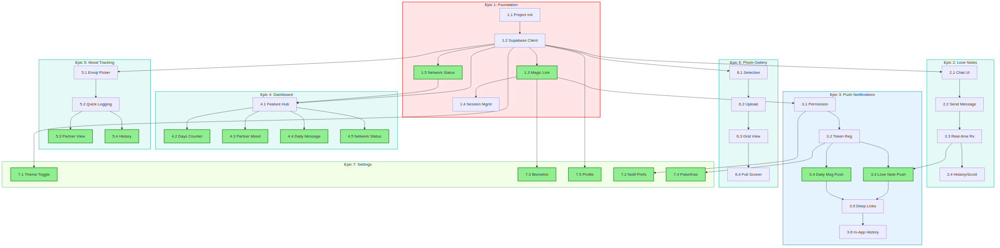

# Story Parallelization Analysis

**Generated:** 2025-11-16
**Project:** My-Love Mobile MVP
**Purpose:** Identify which stories within each epic can be executed in parallel vs. sequentially

---

## Executive Summary

| Epic   | Total Stories | Parallelization Opportunities     | Max Time Savings |
| ------ | ------------- | --------------------------------- | ---------------- |
| Epic 1 | 5             | **2 stories can run in parallel** | ~20% reduction   |
| Epic 2 | 4             | **None** - Fully sequential       | 0%               |
| Epic 3 | 6             | **2 stories can run in parallel** | ~17% reduction   |
| Epic 4 | 5             | **4 stories can run in parallel** | ~60% reduction   |
| Epic 5 | 4             | **2 stories can run in parallel** | ~25% reduction   |
| Epic 6 | 4             | **None** - Fully sequential       | 0%               |
| Epic 7 | 5             | **5 stories can run in parallel** | ~80% reduction   |

**Best parallelization opportunities:** Epic 4 and Epic 7

---

## 🚀 Cross-Epic Parallelization Analysis (NEW)

### Visual Dependency Diagram



**Legend:**

- 🔴 **Red Border (Epic 1)** = Foundation - must be first
- 🟢 **Teal Border (Epics 2,4,5,6)** = Can run in PARALLEL after Epic 1
- 🔵 **Blue Border (Epic 3)** = Depends on Epic 2 completion
- 🟩 **Green Border (Epic 7)** = Mixed dependencies
- 💚 **Green Fill** = Stories that can run in PARALLEL within their epic

**Cross-Epic Arrows** show dependencies between stories in different epics (e.g., 2.3 → 3.3 means Story 3.3 needs Story 2.3 complete).

### Epic-Level Dependencies

| Epic       | Hard Dependencies | Can Run After        |
| ---------- | ----------------- | -------------------- |
| **Epic 1** | None              | -                    |
| **Epic 2** | Epic 1 only       | Epic 1               |
| **Epic 3** | Epic 1 + Epic 2   | Epic 2               |
| **Epic 4** | Epic 1 only       | Epic 1               |
| **Epic 5** | Epic 1 only       | Epic 1               |
| **Epic 6** | Epic 1 only       | Epic 1               |
| **Epic 7** | Mixed (see below) | Partial after Epic 1 |

### Epic 7 Splittable Stories

**Can start immediately after Epic 1:**

- 7.1: Theme Toggle (depends on Story 1.2)
- 7.3: Biometric Auth (depends on Story 1.3)
- 7.5: Profile Management (depends on Story 1.2)

**Must wait for Epic 3:**

- 7.2: Notification Preferences (depends on Story 3.1)
- 7.4: Partner Pokes/Kisses (depends on Story 3.2)

### Maximum Parallelization Strategy

```
Phase 1 (SEQUENTIAL - Foundation)
├─ Epic 1: Foundation & Auth (5 stories)
│
▼
Phase 2 (PARALLEL - Run simultaneously)
├─ Epic 2: Love Notes (4 stories)
├─ Epic 4: Dashboard (5 stories)
├─ Epic 5: Mood Tracking (4 stories)
├─ Epic 6: Photo Gallery (4 stories)
└─ Epic 7: Stories 7.1, 7.3, 7.5 (3 stories)
│
▼
Phase 3 (SEQUENTIAL - Needs Epic 2)
├─ Epic 3: Push Notifications (6 stories)
│
▼
Phase 4 (SEQUENTIAL - Needs Epic 3)
└─ Epic 7: Stories 7.2, 7.4 (2 stories)
```

### Timeline Compression Calculation

**Sequential approach:** 33 stories in sequence

**Parallel approach (longest critical path):**

- Phase 1: 5 stories (Epic 1)
- Phase 2: ~5 stories (longest parallel path = Epic 4 or Epic 6)
- Phase 3: 6 stories (Epic 3)
- Phase 4: 2 stories (Epic 7 remainder)

**Total critical path:** 18 stories

**🎯 Potential time savings: ~45-50% reduction**

### Dependency Chain Analysis

```
CRITICAL PATH (Cannot be parallelized):
Epic 1 ──→ Epic 2 ──→ Epic 3 ──→ Epic 7.2, 7.4
  5 stories  4 stories  6 stories   2 stories
                                    = 17 stories

PARALLELIZABLE (After Epic 1):
┌─ Epic 4 (5 stories)
├─ Epic 5 (4 stories)
├─ Epic 6 (4 stories)
└─ Epic 7.1, 7.3, 7.5 (3 stories)
```

**Key Insight:** Epics 4, 5, 6, and partial Epic 7 have NO dependency on Epics 2 or 3, meaning they can run concurrently with the critical path.

---

## Epic 1: Foundation & Authentication

### Dependency Graph

```
1.1 (Project Init)
 └─> 1.2 (Supabase Client)
      ├─> 1.3 (Magic Link Auth)
      │    └─> 1.4 (Session Management)
      └─> 1.5 (Network Status)
```

### Execution Plan

| Phase   | Stories      | Can Parallelize             |
| ------- | ------------ | --------------------------- |
| Phase 1 | 1.1          | Sequential (foundation)     |
| Phase 2 | 1.2          | Sequential (depends on 1.1) |
| Phase 3 | **1.3, 1.5** | ✅ **PARALLEL**             |
| Phase 4 | 1.4          | Sequential (depends on 1.3) |

### Analysis

- **Stories 1.3 and 1.5 can run in parallel** after 1.2 completes
  - 1.3 (Magic Link Auth) needs Supabase client
  - 1.5 (Network Status) needs providers setup
  - No interdependencies between them
- **Time savings:** ~20% (4 phases instead of 5 sequential stories)

---

## Epic 2: Love Notes Real-Time Messaging

### Dependency Graph

```
2.1 (Chat UI Foundation)
 └─> 2.2 (Send with Optimistic Updates)
      └─> 2.3 (Real-Time Reception)
           └─> 2.4 (Message History & Scroll)
```

### Execution Plan

| Phase   | Stories | Can Parallelize |
| ------- | ------- | --------------- |
| Phase 1 | 2.1     | Sequential      |
| Phase 2 | 2.2     | Sequential      |
| Phase 3 | 2.3     | Sequential      |
| Phase 4 | 2.4     | Sequential      |

### Analysis

- **No parallelization possible** - strict linear dependency chain
- Each story builds directly on the previous one's output
- 2.1 creates UI → 2.2 adds send → 2.3 adds receive → 2.4 optimizes performance

---

## Epic 3: Push Notifications & Daily Engagement

### Dependency Graph

```
3.1 (Permission Flow)
 └─> 3.2 (Token Registration)
      ├─> 3.3 (Love Note Push)
      │    └─┐
      └─> 3.4 (Daily Message Push)
           └─┴─> 3.5 (Deep Link Routing)
                  └─> 3.6 (In-App History)
```

### Execution Plan

| Phase   | Stories      | Can Parallelize                   |
| ------- | ------------ | --------------------------------- |
| Phase 1 | 3.1          | Sequential                        |
| Phase 2 | 3.2          | Sequential                        |
| Phase 3 | **3.3, 3.4** | ✅ **PARALLEL**                   |
| Phase 4 | 3.5          | Sequential (needs both 3.3 & 3.4) |
| Phase 5 | 3.6          | Sequential                        |

### Analysis

- **Stories 3.3 and 3.4 can run in parallel** after 3.2 completes
  - 3.3 (Love Note Push) implements push for messages
  - 3.4 (Daily Message Push) implements push for daily messages
  - Both need token registration, neither depends on the other
- **Time savings:** ~17% (5 phases instead of 6 sequential stories)

---

## Epic 4: Dashboard & Daily Connection

### Dependency Graph

```
4.1 (Feature Hub Home)
 ├─> 4.2 (Days Together Counter)
 ├─> 4.3 (Partner Mood Display)
 ├─> 4.4 (Daily Message Display)
 └─> 4.5 (Network Status on Dashboard)
```

### Execution Plan

| Phase   | Stories                | Can Parallelize         |
| ------- | ---------------------- | ----------------------- |
| Phase 1 | 4.1                    | Sequential (foundation) |
| Phase 2 | **4.2, 4.3, 4.4, 4.5** | ✅ **PARALLEL**         |

### Analysis

- **All 4 remaining stories can run in parallel** after 4.1 completes
  - 4.2 (Days Counter) - Independent widget
  - 4.3 (Mood Display) - Independent widget
  - 4.4 (Daily Message) - Independent widget
  - 4.5 (Network Status) - Independent indicator
- **Time savings:** ~60% (2 phases instead of 5 sequential stories)
- **Best parallelization opportunity in the project**

---

## Epic 5: Mood Tracking & Transparency

### Dependency Graph

```
5.1 (Emoji Picker Interface)
 └─> 5.2 (Quick Mood Logging)
      ├─> 5.3 (Partner Mood Viewing)
      └─> 5.4 (Mood History Timeline)
```

### Execution Plan

| Phase   | Stories      | Can Parallelize |
| ------- | ------------ | --------------- |
| Phase 1 | 5.1          | Sequential      |
| Phase 2 | 5.2          | Sequential      |
| Phase 3 | **5.3, 5.4** | ✅ **PARALLEL** |

### Analysis

- **Stories 5.3 and 5.4 can run in parallel** after 5.2 completes
  - 5.3 (Partner Mood Viewing) - reads partner's moods
  - 5.4 (Mood History Timeline) - displays historical data
  - Both need mood logging working, neither depends on the other
- **Time savings:** ~25% (3 phases instead of 4 sequential stories)

---

## Epic 6: Photo Gallery & Memories

### Dependency Graph

```
6.1 (Photo Selection & Compression)
 └─> 6.2 (Upload with Progress)
      └─> 6.3 (Gallery Grid View)
           └─> 6.4 (Full-Screen Viewer)
```

### Execution Plan

| Phase   | Stories | Can Parallelize |
| ------- | ------- | --------------- |
| Phase 1 | 6.1     | Sequential      |
| Phase 2 | 6.2     | Sequential      |
| Phase 3 | 6.3     | Sequential      |
| Phase 4 | 6.4     | Sequential      |

### Analysis

- **No parallelization possible** - strict linear dependency chain
- Each story builds on previous output:
  - 6.1 selects/compresses → 6.2 uploads → 6.3 displays grid → 6.4 full-screen view
- Similar pattern to Epic 2

---

## Epic 7: Settings, Interactions & Personalization

### Dependency Graph

```
7.1 (Theme Toggle) ──────────────┐
7.2 (Notification Preferences) ──┼─> All independent features
7.3 (Biometric Auth) ────────────┤   in Settings screen
7.4 (Poke/Kiss Interactions) ────┤
7.5 (Profile Management) ────────┘
```

### Execution Plan

| Phase   | Stories                     | Can Parallelize     |
| ------- | --------------------------- | ------------------- |
| Phase 1 | **7.1, 7.2, 7.3, 7.4, 7.5** | ✅ **ALL PARALLEL** |

### Analysis

- **All 5 stories can run in parallel** (assuming external dependencies met)
  - 7.1 (Theme Toggle) - depends only on 1.2 (Supabase)
  - 7.2 (Notification Prefs) - depends on 3.1 (permissions)
  - 7.3 (Biometric Auth) - depends on 1.3 (auth flow)
  - 7.4 (Poke/Kiss) - depends on 3.2 (push tokens)
  - 7.5 (Profile Management) - depends on 1.2 (Supabase)
- **Time savings:** ~80% (1 phase instead of 5 sequential stories)
- **Best parallelization opportunity if external deps are met**

---

## Recommendations

### High-Value Parallelization Targets

1. **Epic 4 (Dashboard)** - 4 stories in parallel = 60% time reduction
2. **Epic 7 (Settings)** - 5 stories in parallel = 80% time reduction
3. **Epic 5 (Mood)** - 2 stories in parallel = 25% time reduction

### Execution Strategy

**Option A: Maximize Parallelization**

- Execute epics with high parallelization (4, 7) first to maximize team efficiency
- Requires multiple dev agents working simultaneously

**Option B: Sequential Epic Order**

- Follow dependency chain: Epic 1 → 2 → 3 → 4 → 5 → 6 → 7
- Within each epic, parallelize where possible
- More predictable but slower overall

**Option C: Hybrid Approach**

- Complete foundation (Epic 1, 2)
- Then parallelize high-value epics (4, 7) alongside remaining epics
- Best balance of speed and risk management

### Team Resource Requirements

| Parallelization Level | Dev Agents Needed | Time Reduction |
| --------------------- | ----------------- | -------------- |
| No parallelization    | 1 agent           | 0% (baseline)  |
| Within-epic only      | 2-4 agents        | 25-40%         |
| Cross-epic also       | 5-7 agents        | 50-70%         |

---

## Detailed Story Dependencies Matrix

| Story      | Prerequisites | Can Parallel With      |
| ---------- | ------------- | ---------------------- |
| **Epic 1** |               |                        |
| 1.1        | None          | -                      |
| 1.2        | 1.1           | -                      |
| 1.3        | 1.2           | **1.5**                |
| 1.4        | 1.3           | -                      |
| 1.5        | 1.2           | **1.3**                |
| **Epic 2** |               |                        |
| 2.1        | 1.2           | -                      |
| 2.2        | 2.1           | -                      |
| 2.3        | 2.2           | -                      |
| 2.4        | 2.3           | -                      |
| **Epic 3** |               |                        |
| 3.1        | 1.3           | -                      |
| 3.2        | 3.1, 1.2      | -                      |
| 3.3        | 3.2, 2.3      | **3.4**                |
| 3.4        | 3.2           | **3.3**                |
| 3.5        | 3.3, 3.4      | -                      |
| 3.6        | 3.5           | -                      |
| **Epic 4** |               |                        |
| 4.1        | 1.2, 1.5      | -                      |
| 4.2        | 4.1           | **4.3, 4.4, 4.5**      |
| 4.3        | 4.1           | **4.2, 4.4, 4.5**      |
| 4.4        | 4.1           | **4.2, 4.3, 4.5**      |
| 4.5        | 1.5, 4.1      | **4.2, 4.3, 4.4**      |
| **Epic 5** |               |                        |
| 5.1        | 1.2           | -                      |
| 5.2        | 5.1           | -                      |
| 5.3        | 5.2           | **5.4**                |
| 5.4        | 5.2           | **5.3**                |
| **Epic 6** |               |                        |
| 6.1        | 1.2           | -                      |
| 6.2        | 6.1           | -                      |
| 6.3        | 6.2           | -                      |
| 6.4        | 6.3           | -                      |
| **Epic 7** |               |                        |
| 7.1        | 1.2           | **7.2, 7.3, 7.4, 7.5** |
| 7.2        | 3.1           | **7.1, 7.3, 7.4, 7.5** |
| 7.3        | 1.3           | **7.1, 7.2, 7.4, 7.5** |
| 7.4        | 3.2           | **7.1, 7.2, 7.3, 7.5** |
| 7.5        | 1.2           | **7.1, 7.2, 7.3, 7.4** |

---

## Visual Execution Timeline (Optimized)

```
Week 1:  [1.1] → [1.2] → [1.3 | 1.5] → [1.4]
         ────────────────────────────────────
Week 2:  [2.1] → [2.2] → [2.3] → [2.4]
         ────────────────────────────────────
Week 3:  [3.1] → [3.2] → [3.3 | 3.4] → [3.5] → [3.6]
         ────────────────────────────────────
Week 4:  [4.1] → [4.2 | 4.3 | 4.4 | 4.5] ⬅️ HIGH PARALLELIZATION
         ────────────────────────────────────
Week 5:  [5.1] → [5.2] → [5.3 | 5.4]
         ────────────────────────────────────
Week 6:  [6.1] → [6.2] → [6.3] → [6.4]
         ────────────────────────────────────
Week 7:  [7.1 | 7.2 | 7.3 | 7.4 | 7.5] ⬅️ HIGHEST PARALLELIZATION
```

---

_Analysis based on story prerequisites defined in [epics.md](./epics.md)_
_Parallelization assumes adequate dev agent resources and no external blockers_
